# Shack-Hartmann Wavefront Sensing and Adaptive Optics Simulations

[](https://github.com/xhvoid/Shack-Hartmann-AO-Simulation/actions/workflows/ci.yml)

This repository is a compact, inspectable simulation study of Shack-Hartmann wavefront sensing, wavefront reconstruction, simplified closed-loop adaptive optics, and PSF-based performance diagnostics.

Its scientific objective is to make the numerical chain from pupil-plane phase errors to WFS measurements, reconstruction, correction, residual wavefronts, and science-wavelength PSFs transparent. It is a portfolio simulation project, not a calibrated observatory simulator or an operational AO pipeline:

```text
pupil-plane phase error
→ wavefront-sensor measurement
→ response / interaction matrix
→ regularized reconstruction
→ deformable-mirror or modal correction
→ residual wavefront
→ PSF, Strehl, FWHM, and encircled-energy diagnostics
```

## Project scope

The repository focuses on five connected parts of an AO simulation chain:

* SH-WFS measurement: geometric slopes and detector-level lenslet spot centroiding.
* Reconstruction: modal response matrices, singular-value diagnostics, and TSVD regularization.
* Closed-loop correction: simplified DM influence functions, integrator control, gain tuning, and delay tests.
* Science diagnostics: residual OPD RMS, Strehl ratio, FWHM, EE50/EE80, and J/H/K PSF comparisons.
* Extensions: simplified PWFS forward modelling, compact noise / latency / gain-stability scans, a fast 2 m detector-level SCAO integration run, and a public-data-informed upgrade of that 2 m demonstrator (ESO ASM / SVO / Pan-STARRS caches with explicit provenance).

Notebook 09 is the closest one to a clean 10 m-class high-order control calculation. It moves from low-order modal correction to a high-order actuator-space SH-AO demonstration with 48 × 48 WFS sampling, a 49 × 49 nominal actuator grid, TSVD command reconstruction, and J/H/K PSF diagnostics. Notebook 10 then asks a more engineering-style question: what happens when measurement noise, loop delay, and gain tuning are no longer ignored?

Notebook 11 is a separate 2 m detector-level SCAO demonstrator. It ties together the detector SH-WFS, synthetic DM, detector-level interaction matrix, closed-loop controller, science PSF metrics, error-budget scenarios, and validation checks into one fast rerunnable path.

## Quick start

The project requires Python 3.10 or newer. From the repository root:

```bash
python3 -m pip install -e ".[test]"
pytest -q
python3 examples/run_fast_integration.py
```

This installs the core package and test dependency, runs the numerical test suite, and executes the lightweight detector-level SCAO integration example. See [Installation](#installation) for notebook and documentation extras.

## Quick review path

For a short technical review, start with:

1. `06_detector_level_shwfs.ipynb` — detector-level SH-WFS centroiding and response calibration.
2. `09_ao_psf_instrument_performance_high_order_ao.ipynb` — high-order actuator-space SH-AO and NIR PSF diagnostics.
3. `10_noise_latency_gain_stability.ipynb` — noise, latency, and gain-stability trade-offs.
4. `11_full_detector_level_2m_scao_demo.ipynb` — fast 2 m detector-level SCAO integration, error-budget table, and validation checks.

The earlier notebooks document the build-up from low-order modal reconstruction to detector-level and closed-loop models.

## Data provenance: real, estimated, synthetic

This is a learning and portfolio project, not an observatory-grade AO simulator. The table below states what is direct public data, what is an engineering estimate, and what is a synthetic model, so the boundary is clear before any figure is read.

| Component | Status | Notes |
| --- | --- | --- |
| ESO ASM seeing snapshot | Direct public-data cache | Nighttime Paranal window; used to condition the synthetic phase amplitude. |
| SVO 2MASS J/H/Ks filters | Direct public-data cache | Used for science-band metric weighting where the caches are present. |
| Pan-STARRS / 2MASS catalog rows | Direct public-data cache | Used as photometric anchors only. |
| WFS photon budget | Engineering estimate | AB-magnitude conversion with explicit assumptions; not measured WFS telemetry. |
| Atmosphere phase sequence | Synthetic | Scaled or conditioned by scenario inputs; not a measured wavefront sequence. |
| DM influence functions | Synthetic | Gaussian / compact model, not a real DM calibration. |
| Interaction matrix | Synthetic detector-level calibration | Built from the repo's own WFS + DM model by central difference. |
| Closed-loop controller | Synthetic compact integrator | Gain, delay, leakage, stroke, and centroid-validity diagnostics. |
| Science PSF metrics | Diagnostic FFT / OPD model | Useful for trends, not calibrated instrument throughput. |
| Validation checks | Internal sanity checks | Reproducibility and physical-trend checks, not external observatory validation. |

Centroid validity is screened by flux, peak SNR, centroid-uncertainty, and window-clipping thresholds (not just a finite centroid), so faint sub-photon WFS budgets report low valid-centroid fractions rather than plausible-looking centroids built from noise. See the [provenance summary](#provenance-summary) and [validation and limitations](#validation-and-limitations) sections for detail.

## Representative results

The selected figures below illustrate the simulation outputs and diagnostic trends discussed in the notebooks. They are reproducible from the tracked configurations and examples described later in this README.

### Public data anchors for the detector-level extension

The detector-level extension now uses small tracked public-data caches for the atmosphere, science bandpasses, and catalog photometry: an ESO Paranal ASM nighttime window, SVO 2MASS J/H/Ks filter curves, IRSA 2MASS PSC, and MAST Pan-STARRS DR2.

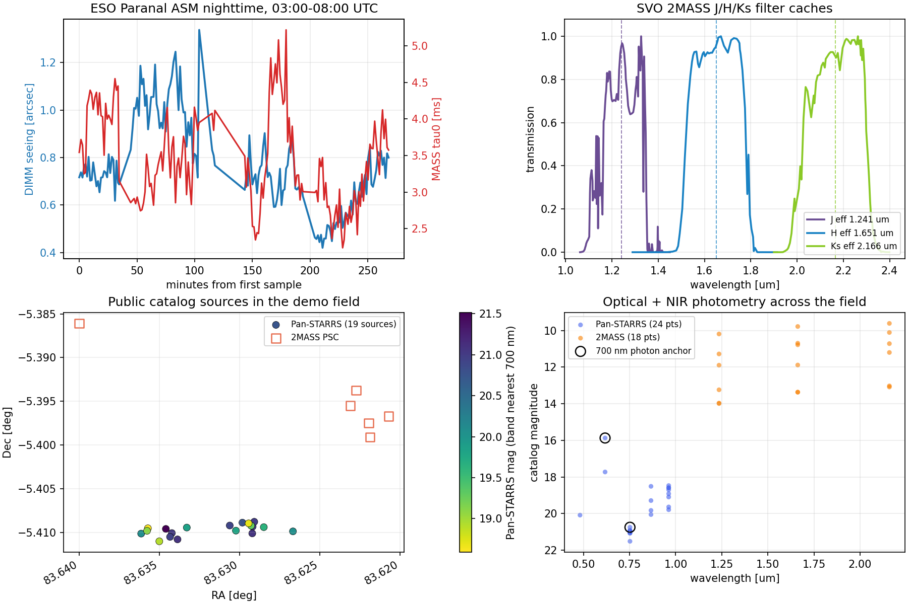

The direct SVO J/H/Ks filter curves are used by the science-metric path when the caches are present. The older top-hat bands remain only as documented fallbacks.

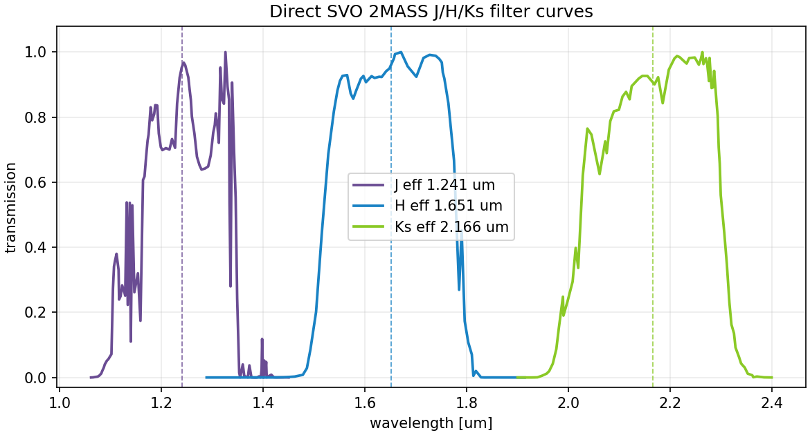

The Pan-STARRS optical cache is also used for a simple 700 nm WFS photon-budget estimate. This is an engineering input estimate, not measured WFS telemetry.

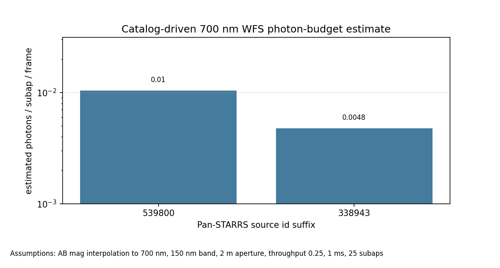

The slower public-data-informed AO demo then uses the ESO ASM seeing snapshot to scale the synthetic phase amplitude and the Pan-STARRS photon-budget anchor to stress the fast detector-level loop. The loop and DM model are still synthetic, but the conditioning data are real public caches.

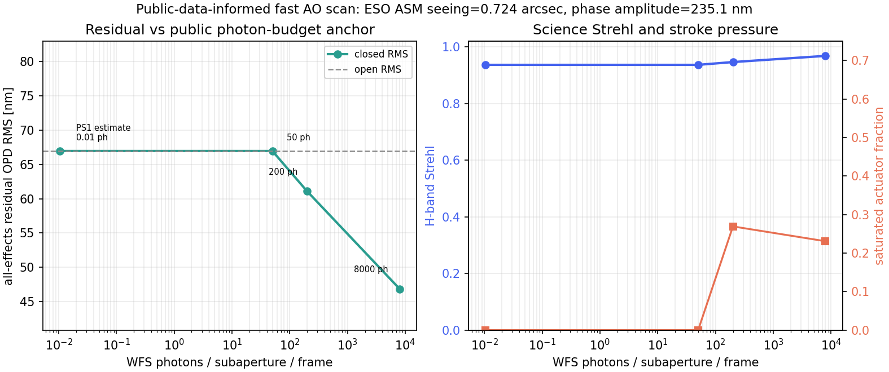

Notebook 11 also writes a five-condition public-data-informed scenario table. The conditions, not the numerical mode, control seeing, photon budget, read noise, latency, stroke, NCPA, and misregistration proxies.

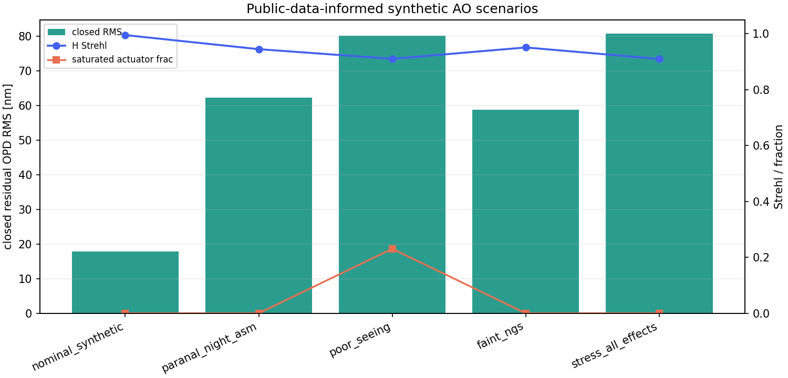

### High-order AO correction: NIR PSF sharpening

Notebook 09 compares three PSF cases: diffraction-limited, open-loop atmospheric, and AO-corrected.

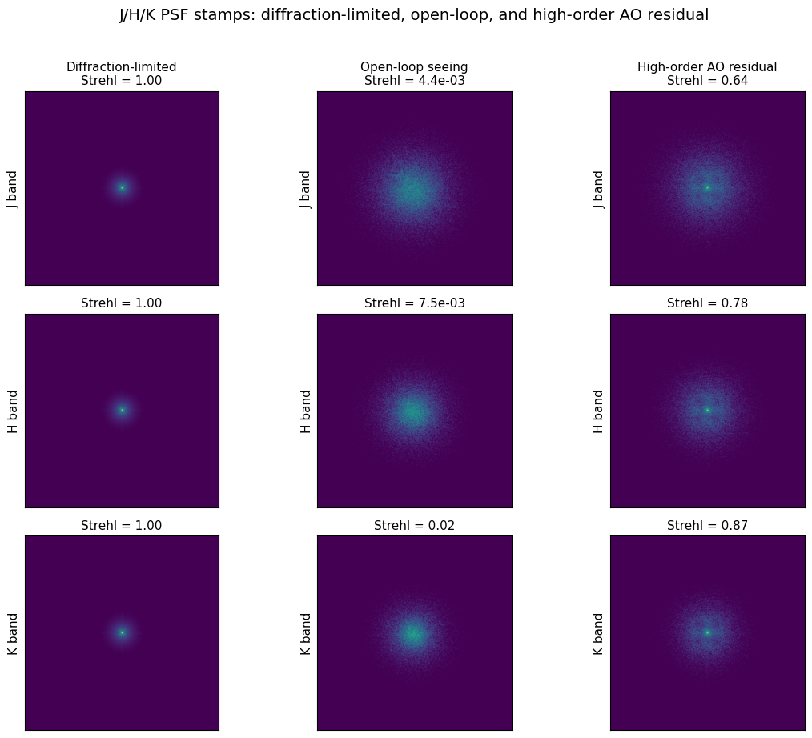

### Closed-loop residual OPD RMS

The high-order loop is run on a frozen-flow atmospheric sequence. I use the post-settling residual OPD RMS as the main wavefront-error diagnostic.

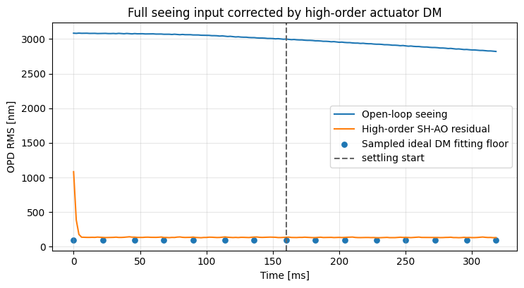

### Wavefront correction maps

The wavefront maps show the open-loop atmospheric phase, the DM correction, and the final closed-loop residual. This illustrates that the controller reconstructs actuator commands rather than only fitting low-order Zernike modes.

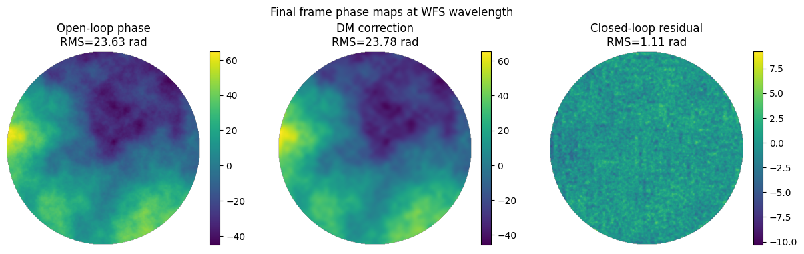

### Noise, latency, and loop-gain trade-offs

Notebook 10 scans photon flux, read noise, loop gain, and frame delay. The gain-delay panel marks the chosen operating point and hatches cells where the loop becomes unstable or command-limited.

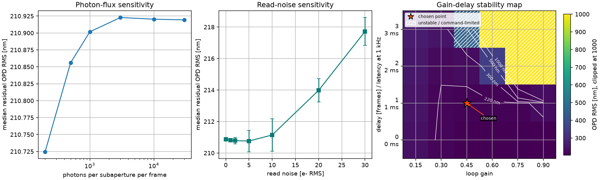

### Fast 2 m detector-level SCAO integration

Notebook 11 runs the smaller detector-level SCAO path end to end and writes a compact error-budget table, validation summary, figures, and reference metrics.

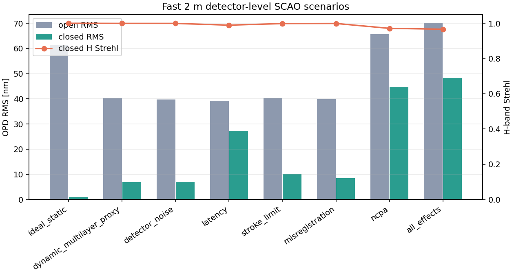

### Simplified PWFS detector images

The PWFS branch is exploratory. It shows detector-plane pupil images and normalized slope-like signal maps, but it is not a validated PWFS control simulator.

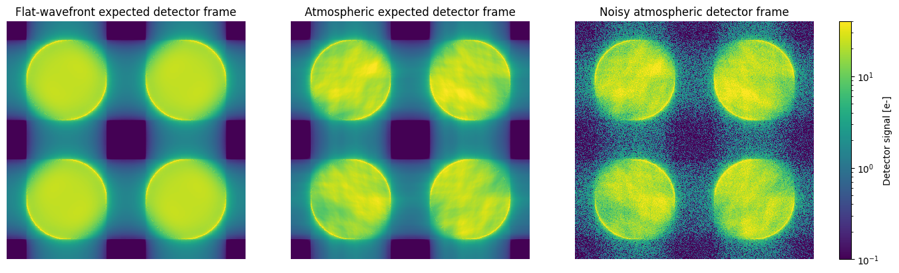

### Sampling density versus correction order

This diagnostic tracks how WFS sampling density and controlled modal order affect conditioning and correction quality.

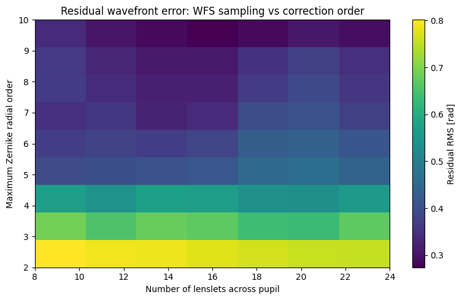

### Detector-level Shack-Hartmann reconstruction

The detector-level SH-WFS notebooks simulate lenslet spots, finite detector windows, noise, centroiding, reference subtraction, and response-matrix reconstruction.

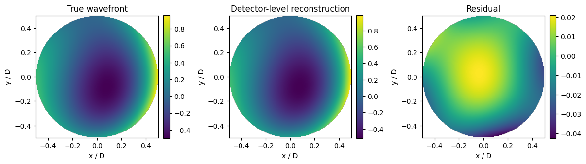

## Repository layout

```text
src/          reusable AO, WFS, reconstruction, PSF, and PWFS utilities
notebooks/    narrative simulations from SH-WFS basics to high-order AO
examples/     lightweight command-line demonstrations
tests/        numerical sanity checks for the core modules
configs/      documented synthetic and literature-inspired presets
data/         tracked public caches, sample fixtures, and reference metrics
figures/      selected outputs used in this README and generated examples
docs/         architecture, validation, and provenance documentation
scripts/      public-data refresh and report-generation utilities
CITATION.cff  citation metadata
LICENSE       MIT license
```

## Code architecture

I kept the reusable numerical pieces in `src/` so the notebooks stay readable and the core functions can be tested independently. The notebooks are closer to experiment logs; the modules hold the reusable modelling components. [`docs/architecture.md`](docs/architecture.md) shows the full module pipeline as a diagram.

| Module              | Main role                                                                                                                                                       |
| ------------------- | --------------------------------------------------------------------------------------------------------------------------------------------------------------- |
| `zernike.py`        | Pupil grids, Zernike modes, modal synthesis, piston removal, and RMS utilities.                    |
| `phase_screen.py`   | Atmospheric-like phase screens, seeing / `r0` scaling, OPD conversion, and frozen-flow shifts.     |
| `reconstruction.py` | Geometric SH-WFS slopes, response matrices, modal reconstruction, and residual metrics.           |
| `shwfs_detector.py` | Lenslet spots, detector noise, centroiding, reference subtraction, and detector response matrices. |
| `ao_closed_loop.py` | Gaussian DM influence functions, DM-WFS calibration, command updates, and loop diagnostics.       |
| `psf_tools.py`      | FFT PSFs, Strehl ratios, radial profiles, Marechal approximation, and wavelength scaling.         |
| `pwfs_forward.py`   | Simplified Fourier-optics PWFS forward model and `Sx/Sy` signal maps.                            |
| `synthetic_instrument_data.py` | Detector-level 2 m SH-WFS geometry, reference centroids, noisy measurements, and centroid diagnostics. |
| `dm_model.py`       | Synthetic DM influence functions, actuator masks, stroke limits, and OPD/phase synthesis.        |
| `interaction_matrix.py` | Detector-level DM poke matrices, SVD diagnostics, and TSVD command reconstruction.           |
| `ao_conditions.py`  | Observing-condition presets that keep seeing, photon budget, detector noise, latency, stroke, NCPA, and misregistration separate from numerical integration scale. |
| `ao_error_budget.py` | Eight-scenario 2 m SCAO error-budget table with OPD, Strehl, EE, command, and centroid metrics. |
| `ao_validation.py`  | Small pass/fail checks for Marechal consistency, diffraction scale, monotonicity, reproducibility, and DM fitting trend. |
| `ao_integration.py` | Fast notebook-11 integration runner, exported figures, and reference-metrics JSON.              |

## Notebook sequence

| Notebook                                               | Purpose                                                                                                                                                                                                                                                                           |
| ------------------------------------------------------ | --------------------------------------------------------------------------------------------------------------------------------------------------------------------------------------------------------------------------------------------------------------------------------- |
| `01_test_sh_wfs.ipynb`                                 | Initial SH-WFS sanity checks for slopes, modal reconstruction, residuals, and Strehl.                                                                                                                               |
| `02_sh_wfs_experiment.ipynb`                           | Baseline SH-WFS experiments with fixed/random wavefronts, spot checks, photon noise, and PSFs.                                                                                                                      |
| `03_zernike_mode_scan.ipynb`                           | Reconstruction quality versus Zernike order and controlled mode count.                                                                                                                                              |
| `04_sampling_vs_mode_order_heatmap.ipynb`              | WFS sampling density versus correction order and conditioning.                                                                                                                                                      |
| `05_tsvd_regularization.ipynb`                         | TSVD regularization in an intentionally ill-conditioned reconstruction problem.                                                                                                                                      |
| `06_detector_level_shwfs.ipynb`                        | Detector-level SH-WFS centroiding, response calibration, reconstruction, and noise scans.                                                                                                                           |
| `07_closed_loop_ao.ipynb`                              | Geometric closed-loop AO baseline with Gaussian DM influence functions and an integrator controller.                                                                                                                |
| `07_detector_level_closed_loop_ao.ipynb`               | Closed-loop AO driven by detector-level centroid shifts instead of ideal slopes.                                                                                                                                    |
| `08_pwfs_detector_level_atmospheric_turbulence.ipynb`  | Exploratory detector-level PWFS forward model with four pupil images and `Sx/Sy` maps.                                                                                                                             |
| `09_ao_psf_instrument_performance_high_order_ao.ipynb` | High-order actuator-space SH-AO demonstrator with 48 × 48 WFS sampling, 49 × 49 nominal actuator grid, TSVD reconstruction, and J/H/K PSF diagnostics.                                                             |
| `10_noise_latency_gain_stability.ipynb`                | Photon/read-noise, loop-delay, and gain-stability trade-offs.                                                                                                                                                       |
| `11_full_detector_level_2m_scao_demo.ipynb`            | Fast 2 m detector-level SCAO integration using the reusable detector, DM, interaction-matrix, control, error-budget, science-metric, and validation modules.                                                        |

## Installation

Clone the repository:

```bash
git clone https://github.com/xhvoid/Shack-Hartmann-AO-Simulation.git
cd Shack-Hartmann-AO-Simulation
```

Install the runtime dependencies (numpy, scipy, matplotlib, pandas):

```bash
python3 -m pip install -e .
```

Notebook, test, and documentation tools are kept as optional extras so a plain
install stays lightweight. Add only what you need:

```bash
python3 -m pip install -e ".[test]"               # pytest
python3 -m pip install -e ".[notebooks]"           # jupyter, ipykernel
python3 -m pip install -e ".[docs]"                # reportlab (provenance PDF)
python3 -m pip install -e ".[test,notebooks,docs]" # everything
```

`requirements.txt` lists the runtime dependencies only, mirroring the
`pyproject.toml` core dependencies.

## Running tests

After installing the `test` extra, run the focused numerical test suite:

```bash
pytest -q
```

The GitHub Actions workflow in `.github/workflows/ci.yml` runs `pytest -q` on Python 3.11, executes the two lightweight examples, and then runs a fast detector-level SCAO smoke check:

```bash
python3 examples/run_psf_strehl_demo.py
python3 examples/run_shwfs_centroid_demo.py
python3 examples/run_public_data_overview.py
python3 examples/run_fast_integration.py
```

The slower public-data-informed AO scan is intentionally excluded from CI and remains a local diagnostic run.

## Command-line examples

The examples provide command-line entry points for checking the code without opening Jupyter:

```bash
python3 examples/run_shwfs_centroid_demo.py
python3 examples/run_psf_strehl_demo.py
python3 examples/run_interaction_matrix_demo.py
python3 examples/run_science_metrics_demo.py
python3 examples/run_public_data_overview.py
python3 examples/run_public_data_informed_ao_demo.py
python3 examples/run_error_budget_demo.py
python3 examples/run_validation_checks_demo.py
python3 examples/run_fast_integration.py
```

`run_public_data_informed_ao_demo.py` is a slower local scan because it runs
several fast integration configurations; it is not part of CI. It records its
wall-clock runtime in `figures/detector_level_SCAO/public_data_informed_runtime.csv`
and `.json` with a 30 minute local-run limit flag.

These scripts write artifacts under `figures/detector_level_SCAO/`:

```text
figures/detector_level_SCAO/shwfs_centroid_demo.png
figures/detector_level_SCAO/shwfs_centroid_demo.csv
figures/detector_level_SCAO/psf_strehl_demo.png
figures/detector_level_SCAO/psf_strehl_demo.csv
figures/detector_level_SCAO/public_data_overview.png
figures/detector_level_SCAO/public_filter_curves_jhk.png
figures/detector_level_SCAO/public_data_photon_budget.png
figures/detector_level_SCAO/public_data_summary.csv
figures/detector_level_SCAO/public_data_photon_budget.csv
figures/detector_level_SCAO/public_data_informed_ao_photon_scan.png
figures/detector_level_SCAO/public_data_informed_ao_photon_scan.csv
figures/detector_level_SCAO/public_data_informed_conditions.csv
figures/detector_level_SCAO/public_data_informed_error_budget.png
figures/detector_level_SCAO/public_data_informed_error_budget.csv
figures/detector_level_SCAO/public_data_informed_runtime.csv
figures/detector_level_SCAO/public_data_informed_runtime.json
figures/detector_level_SCAO/public_data_informed_validation.png
figures/detector_level_SCAO/public_data_informed_validation.csv
figures/detector_level_SCAO/fast_error_budget.png
figures/detector_level_SCAO/fast_error_budget.csv
figures/detector_level_SCAO/fast_validation.png
figures/detector_level_SCAO/fast_validation.csv
data/reference_metrics/fast_reference_metrics.json
```

For heavier local reruns, the integration API exposes explicit presets:

```python
from ao_integration import IntegrationConfig, run_integration

run_integration(IntegrationConfig.from_mode("portfolio"))
run_integration(IntegrationConfig.from_mode("research"))
```

Only `fast` is part of the automated test suite; the heavier presets are for local figure-quality or exploration runs.

## Running the notebooks

Start Jupyter from the repository root:

```bash
jupyter notebook
```

Recommended reading order:

```text
01 → 02 → 03 → 04 → 05 → 06 → 07 → 07_detector_level_closed_loop_ao → 08 → 09 → 10 → 11
```

For the high-order AO PSF result, start directly with:

```text
09_ao_psf_instrument_performance_high_order_ao.ipynb
```

For noise, latency, and loop-gain trade-offs, start with:

```text
10_noise_latency_gain_stability.ipynb
```

For the fast 2 m detector-level integration path, start with:

```text
11_full_detector_level_2m_scao_demo.ipynb
```

## Reproducibility and validation

I use four lightweight checks rather than trying to execute every notebook in CI:

* Unit tests validate the numerical core: PSF normalization, Strehl sanity checks, phase/OPD conversion, detector centroiding edge cases, phase-screen RMS scaling, and modal reconstruction.
* Command-line examples regenerate small PNG and CSV artifacts from deterministic seeds.
* Notebooks remain the narrative entry points for the broader AO experiments, with notebook 10 explicitly separating clean-model AO performance from noise, latency, and controller-stability stress tests.
* Notebook 11 is smoke-tested in fast mode and writes `data/reference_metrics/fast_reference_metrics.json` for future regression checks.

## Provenance summary

| Source class | Current use | Caveat |
| ------------ | ----------- | ------ |
| `direct_public_data` | Small tracked public caches in `data/public/`: SVO `2MASS/2MASS.J/H/Ks` filter curves, IRSA 2MASS PSC NIR photometry, MAST Pan-STARRS DR2 optical photometry, and an ESO Paranal ASM nighttime atmosphere snapshot/time series. | The fast run and optional public-data-informed demo consume cached public products offline; they do not query the internet during tests. |
| `literature_derived` / `synthetic_literature_inspired` | Atmosphere profile notes, Paranal-like fallback profiles, and synthetic Gaussian DM choices inspired by public literature. | These are not measured AO calibrations. |
| `synthetic_assumed` | Detector, guide-star flux, loop, error-budget, and fast integration parameters. | Treat these as controlled demonstration settings. |
| `package_reference` | Reserved for package/library reference values when needed. | Not a substitute for observatory validation. |

The public caches can be refreshed with:

```bash
python3 scripts/fetch_public_reference_data.py
```

Gaia Archive and ERA5 are still treated carefully. Gaia remains a valid target
source for astrometry, but Pan-STARRS DR2 is the current optical-photometry
substitute because the Gaia Archive was inaccessible from this environment.
ERA5/CDS is not claimed as used; the current atmosphere conditioning comes from
ESO ASM seeing/tau0/theta0/turbulence-speed caches, and ERA5 would require user
CDS credentials plus a separate meteorological downselection.

## Notes on the main modelling choices

### 1. Detector-level SH-WFS measurement chain

The detector-level Shack-Hartmann model follows the measurement process more explicitly than a geometric slope model:

```text
local pupil phase
→ lenslet focal-plane spot
→ finite detector window
→ photon / read / background noise
→ centroid measurement
→ reference-subtracted centroid shift
→ calibrated response matrix
→ modal reconstruction
```

I included this branch because real Shack-Hartmann sensors do not measure continuous slopes directly. They measure spot images on detector pixels. Centroiding error, finite sampling, photon statistics, read noise, spot clipping, and thresholding all enter before the reconstruction step.

### 2. Response-matrix conditioning and TSVD regularization

The reconstruction problem is treated as a linear inverse problem. Each WFS model produces an interaction matrix whose singular values determine which modal or actuator combinations are strongly or weakly sensed.

The TSVD notebooks show why keeping every singular direction is not always useful. Weak singular directions can amplify noise or unstable command components, while overly aggressive truncation removes controllable modes. The cutoff is a system-level trade-off between fitting error, noise amplification, command conditioning, and image quality.

For the fast 2 m detector-level path, the current poke matrix is intentionally compact. It is best read as a detector-level DM/WFS response sanity check: all controlled modes remain well above the selected TSVD cutoff for this demonstrator configuration, so it should not be presented as a realistic high-order detector-level reconstructor-conditioning study.

### 3. Closed-loop AO correction

The closed-loop branch uses a simplified deformable mirror with Gaussian influence functions and an integrator controller. The simulations track residual phase RMS, Strehl ratio, command evolution, and gain stability over loop iterations.

The detector-level closed-loop experiment is deliberately simplified, but it no longer uses ideal analytic slopes. The loop is driven by centroid-shift measurements from simulated lenslet spots.

### 4. High-order actuator-space AO / NIR PSF performance

Notebook 09 takes the earlier low-order examples into a higher-order actuator-space SH-AO loop.

The current high-order run uses:

```text
AO_QUALITY_MODE = "extreme"
N_SUBAP         = 48
N_ACT_ACROSS   = 49
N_PUPIL        = 384
TSVD rcond      = 2e-2
loop gain       = 0.65
```

For the adopted 0.8 arcsec seeing, the SH-WFS subaperture size is close to the Fried parameter at the WFS wavelength. The controller uses an actuator poke matrix and TSVD command reconstruction, then converts residual OPD into J/H/K science PSF metrics.

Representative clean-run results:

```text
open-loop median OPD RMS after settling    ≈ 2914 nm
closed-loop median OPD RMS after settling  ≈ 135 nm
correction factor                          ≈ 22×
```

Approximate NIR Strehl ratios:

```text
J band  ≈ 0.64
H band  ≈ 0.77
K band  ≈ 0.86
```

These values should be read as a clean-model performance demonstration rather than a calibrated prediction for a specific telescope or AO system.

I keep this caveat explicit because the numbers are useful for comparing clean-model cases, but they are not a substitute for a calibrated instrument error budget.

### 5. Noise, latency, and loop-gain stability

Notebook `10_noise_latency_gain_stability.ipynb` adds a compact engineering trade-off layer around the closed-loop AO model. It scans photon flux, read noise, a transparent centroid-noise proxy, loop gain, and frame delay, then reports residual OPD RMS, H-band Marechal Strehl, command growth, and a simple stability flag.

This is not a full AO error budget. Its purpose is to make the controller trade-offs visible: noise floors limit the value of high gain, latency narrows the stable gain range, and clean-model Strehl can be optimistic when detector and timing effects are ignored. The delay axis is also labelled as physical latency for a nominal 1 kHz loop.

The gain-delay map is the main control-engineering diagnostic in notebook 10. The photon-flux residual scan should be read more cautiously: in the current setting, residual OPD changes by only a small amount because latency, model dynamics, and the simplified DM/WFS geometry dominate the residual floor. The cleaner photon-noise sanity check is the centroid-RMS monotonicity scan, where centroid noise decreases with photon count.

### 6. Fast 2 m detector-level SCAO integration

Notebook `11_full_detector_level_2m_scao_demo.ipynb` is the fast integration path for the compact 2 m detector-level SCAO demonstrator. It does not replace notebook 09; it answers a different question. Notebook 09 shows a clean high-order 10 m-class actuator-space control case, while notebook 11 keeps the system smaller and routes the simulation through detector-level SH-WFS centroiding, a synthetic DM, a detector-level poke matrix, closed-loop correction, J/H/K science metrics, error-budget scenarios, and validation checks.

The command-line entry point is `examples/run_fast_integration.py`. It writes reference metrics with tolerances so later changes can be checked against open RMS, closed RMS, H-band Strehl, valid-centroid fraction, kept modes, and runtime band.

The main notebook-11 performance claims are residual OPD RMS, H-band Strehl, centroid validity, command RMS/peak command, saturation fraction, and validation pass/fail checks. EE50/EE80 are kept as secondary PSF diagnostics because the small fast-mode PSF grid can make encircled-energy values visibly quantized.

**Public-data-informed scenario suite.** The model separates *numerical scale* (`IntegrationConfig` fast/portfolio/research modes) from *observing difficulty* (`ObservingConditionConfig`: `nominal_synthetic`, `paranal_night_asm`, `poor_seeing`, `faint_ngs`, `stress_all_effects`), so a heavier rerun never silently means worse seeing or a fainter star. The public-data-informed path (`examples/run_public_data_informed_ao_demo.py`) draws the atmosphere from the nighttime ESO ASM cache (seeing → r0 → an ESO-ASM-conditioned *synthetic* phase sequence), the science bandpasses from the direct SVO 2MASS J/H/Ks curves, and the WFS photon budget from a Pan-STARRS AB-magnitude estimate, then writes a five-condition error-budget table with explicit provenance columns. The synthetic AO-internal terms are represented explicitly through an affine WFS–DM misregistration proxy (sub-pixel shift, rotation, magnification, shear), a three-component NCPA generator (low-order Zernike + mid-spatial-frequency ripple + static polishing-like term), a decomposed latency model, and named visible-WFS detector presets. The detector-level interaction-matrix diagnostics add a central-difference poke-amplitude scan and a TSVD noise-amplification proxy.

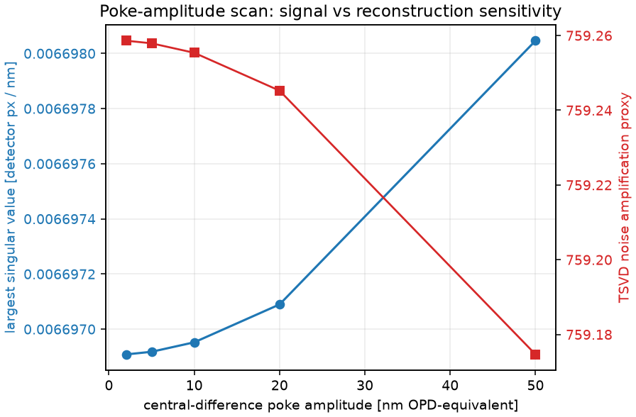

Because the richer NCPA and misregistration models feed the eight-scenario `all_effects` case, the fast reference-metrics schema is version 2. It still runs offline, top-to-bottom, with all metrics finite and validation passing, and the saved reference baselines match that schema.

### 7. PWFS extension

The pyramid-WFS branch uses a compact Fourier-optics model. The pupil field is propagated to the focal plane, multiplied by a pyramid-like phase mask, and propagated back to form four re-imaged pupil intensities. Normalized `Sx/Sy` maps are then used as the PWFS measurement vector.

This branch should be read as an exploratory extension. It demonstrates the PWFS measurement logic and modal calibration, but it does not yet include a fully validated PWFS modulation, control, and detector-readout model.

## Validation and limitations

[`docs/validation.md`](docs/validation.md) lists the internal sanity checks (Marechal consistency, diffraction scale, photon/read-noise/latency trends, DM-fitting trend, reproducibility, centroid validity) and what is explicitly *not* validated.

The current implementation intentionally keeps several assumptions simple:

* The atmosphere is represented by compact Kolmogorov / von Karman-like phase screens.
* Some atmospheric screens are RMS-normalized for controlled tests.
* The deformable mirror uses idealized Gaussian influence functions.
* The detector models are simplified.
* The SH-WFS branch is more mature than the PWFS branch.
* The PWFS branch is a compact Fourier-optics demonstrator, not a fully validated PWFS control simulator.
* The high-order notebook uses a geometric SH-WFS slope model rather than detector-level spot centroiding.
* The high-order notebook does not include photon noise, read noise, centroiding error, detector nonlinearity, temporal delay, vibration, wind-shake, or a full servo-lag error budget.
* Notebook 10 explores photon/read noise and delay through a simplified proxy model rather than a calibrated detector and real-time-control simulator.
* Notebook 11 uses reduced fast-mode sampling for reproducibility; its detector, DM, atmosphere, guide-star, NCPA, misregistration, and stroke terms are synthetic or literature-inspired placeholders.
* Notebook 11 is a compact 2 m SCAO demonstrator, not an ELT-scale or MICADO-scale performance prediction.
* EE50/EE80 values in the fast path can be limited by PSF sampling and radius-grid quantization, so they should be treated as secondary diagnostics rather than headline performance claims.
* The fast reference metrics are regression targets for this repository, not validation against observatory telemetry.
* The high-order notebook does not include multi-layer tomography, LGS cone effect, NCPA, chromaticity, throughput, sky background, or science-camera noise.
* The simulations are not calibrated to a specific telescope, instrument, guide-star configuration, or observatory AO system.

These limitations are intentional: the project is designed to make the modelling chain inspectable and educational rather than to hide assumptions inside a black-box simulator.

## Author

Xu Han
MSc Astrophysics, LMU Munich
MSc Photonics student, Hochschule München

Research interests: adaptive optics, astronomical instrumentation, detector-level wavefront sensing, PSF modelling, instrument-performance prediction, and astrophotonics.

## Citation and license

If you use this repository, please cite it using the metadata in [CITATION.cff](CITATION.cff). The project is released under the [MIT License](LICENSE).
