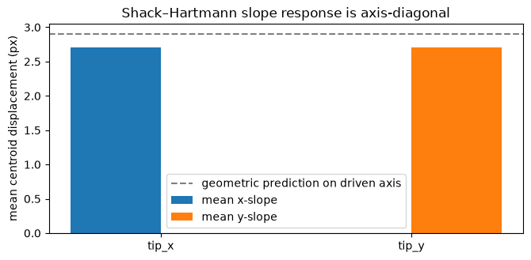
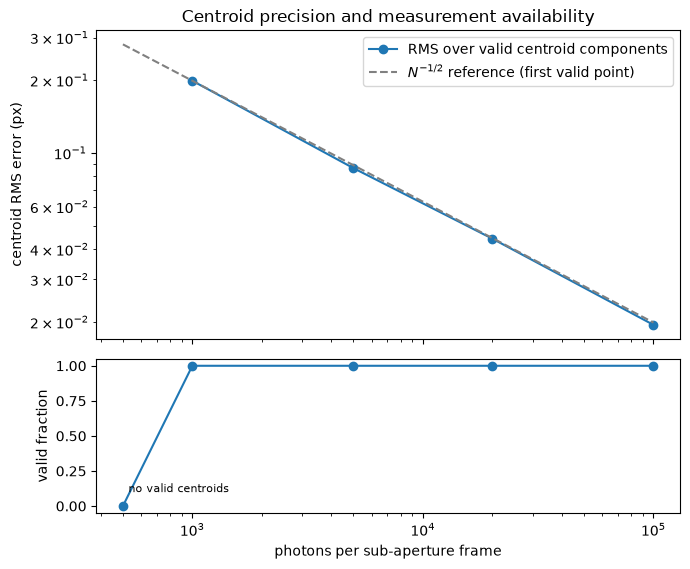
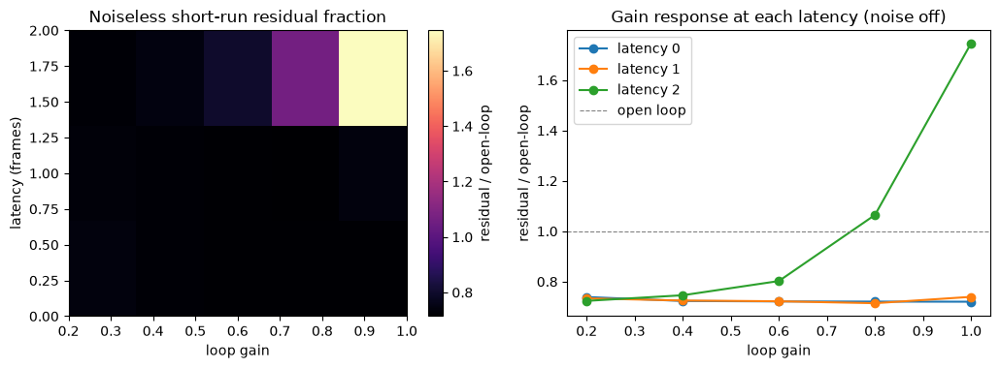
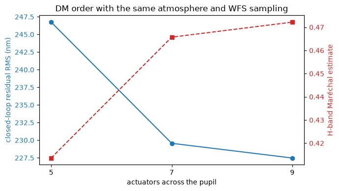
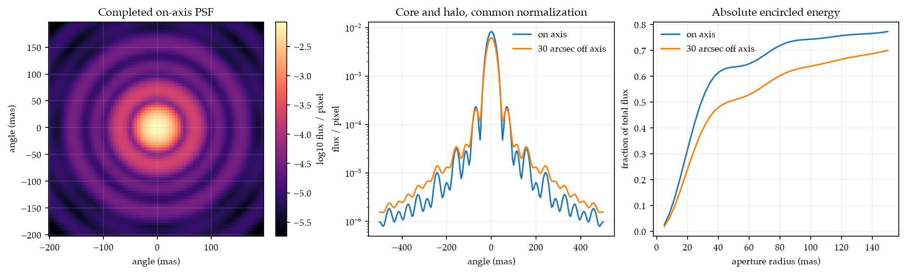
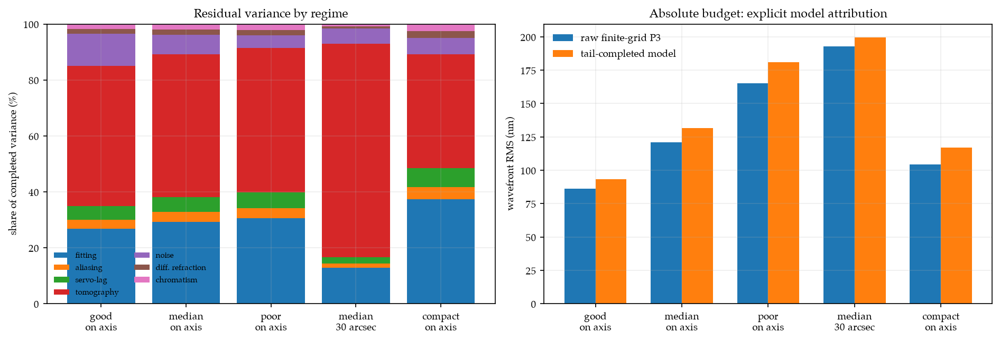

# Shack-Hartmann Wavefront Sensing & Adaptive Optics

[](https://github.com/xhvoid/Shack-Hartmann-AO-Simulation/actions/workflows/ci.yml)
[](pyproject.toml)
[](LICENSE)

**An optical engineering project connecting wavefronts, detector images,
calibrated reconstruction, feedback control and science-image quality.**

A modular Shack-Hartmann SCAO simulation framework with native and HCIPy
optical backends, custom detector and real-time-control modelling,
science-facing PSF diagnostics, and cross-backend physical validation.

The central question is how an optical disturbance becomes a measurement,
how that measurement becomes a mirror command, and how the remaining error
appears in an astronomical image. The project follows that chain in Python
and uses controlled experiments to distinguish physical effects from noise,
calibration choices and numerical sampling.

The native model uses single-conjugate adaptive optics (SCAO). Wavefronts are
represented as optical path difference (OPD), and the point spread function
(PSF) connects residual aberrations to image quality.

In the introductory closed-loop experiment, matched final-half wavefront RMS
falls from **148.6 to 84.4 nm**, a **43.2% reduction**. A complementary
system-level study shows why residual RMS alone is insufficient: worsening
seeing reduces energy inside a fixed science aperture by **27.1%**, while
the measured PSF core width changes only slightly. These are results of the
specified synthetic experiments below.


*Figure 1 — A 1 m, 500 Hz, 12-frame native SCAO example, with gain 0.5,
zero frame delay and detector noise disabled. Open and corrected RMS use the
same atmospheric trajectory and final six frames. This short experiment
demonstrates correction and transients; longer runs and multiple seeds are
needed to assess sustained performance. [Executed notebook](notebooks/tutorials/04_closed_loop_control.ipynb).*

**A short review route:**
[sensor and detector analysis](#sensor-and-detector-analysis) →
[reconstruction and control](#reconstruction-and-control) →
[PSFs and error budgets](#psfs-and-error-budgets) →
[validation evidence](#validation-evidence).
For execution, see [Run the project](#run-the-project).

## What the project demonstrates

| Engineering task | Implementation | Evidence to inspect |
| --- | --- | --- |
| Connect optics to measurements | OPD/phase conversion, von Kármán frozen-flow turbulence, lenslet propagation and detector sampling | [Wavefront tutorial](notebooks/tutorials/00_wavefront_and_atmosphere.ipynb), [sensor calibration](notebooks/tutorials/01_geometric_shwfs.ipynb) |
| Extract reliable measurements from images | Photon/read noise, detector response, reference centroids, quality masks and explicit invalid measurements | [Detector tutorial](notebooks/tutorials/02_detector_centroiding.ipynb), [detector-level SCAO](notebooks/studies/detector_level_2m.ipynb) |
| Calibrate and solve an inverse problem | Actuator/modal interaction matrices, singular-spectrum diagnostics, least squares, TSVD and Tikhonov reconstruction | [Reconstruction tutorial](notebooks/tutorials/03_tsvd_regularization.ipynb), [calibration API](src/shwfs_ao/calibration) |
| Test feedback under practical constraints | Leaky integration, frame latency, actuator stroke/fault policies and feedback of the applied command | [Control tutorial](notebooks/tutorials/04_closed_loop_control.ipynb), [gain/delay study](notebooks/studies/noise_latency_gain.ipynb) |
| Relate optical errors to science images | Fourier PSFs, peak Strehl, FWHM, encircled energy and atmospheric/guide-star sensitivity | [TIPTOP study](notebooks/studies/12_TIPTOP_performance_modelling.ipynb), [science API](src/shwfs_ao/science) |
| Make numerical conclusions reviewable | Analytic references, sampling checks, backend comparisons, seeded artifacts and automated execution | [Numerical verification](docs/numerical_accuracy_fixes.md), [validation policy](docs/validation.md) |

The native NumPy/SciPy implementation makes the numerical chain inspectable.
Optional **HCIPy** adapters provide independently implemented optical
components through the same interfaces. A separate **TIPTOP/P3 and MASTSEL**
study adds analytical multi-guide-star sensitivity modelling. The time-domain
and analytical studies answer different questions and retain their own
configurations and validation limits.

## Sensor and detector analysis

### Calibrate the response before reconstructing the wavefront

The [Shack-Hartmann calibration tutorial](notebooks/tutorials/01_geometric_shwfs.ipynb)
uses a 1 m pupil, 8×8 lenslet geometry, 52 illuminated sub-apertures and a
700 nm sensing wavelength. Independent **2 µrad** x and y tilts test response
sign, scale and cross-axis coupling.

| Quantity | Recorded value |
| --- | --- |
| Geometric displacement on the driven axis | 2.902 px |
| Measured mean centroid displacement | 2.701 px |
| Measured/geometric response gain | **0.9305** |

The finite sampled spot window produces a response below the simple geometric
prediction. This motivates measuring the response of the complete optical and
detector chain rather than using geometry alone as the reconstruction scale.

<details>
<summary><strong>View the two-axis calibration figure</strong></summary>



*Figure 2 — The driven-axis responses agree, while the orthogonal response is
negligible in this symmetric synthetic configuration. The dashed line is the
geometric prediction. [Source notebook](notebooks/tutorials/01_geometric_shwfs.ipynb).*

</details>

### Report precision and measurement availability together

The [detector experiment](notebooks/tutorials/02_detector_centroiding.ipynb)
holds one static aberration fixed and varies photons per sub-aperture per
frame. It pools centroid errors over valid components from **12 realizations**,
relative to a noise-free reference. Photon noise, configured read noise and
centroid-quality cuts remain part of the measurement chain.



*Figure 3 — Valid-component centroid RMS decreases from **0.1987 px at
1,000 photons** to **0.01944 px at 100,000 photons**. The dashed inverse-square-root
reference is anchored to the first valid point. At 500 photons, this
configuration yields **no valid centroids**; its measured RMS is NaN.*

The two panels carry different information: precision describes the accepted
measurements, while availability describes how much data survived the quality
policy. Treating an invalid centroid as zero would hide the low-flux failure.
The trend is consistent with the reference over the valid points, but this
small experiment does not establish a universal shot-noise law.

## Reconstruction and control

### Inspect which modes the measurement can support

The [TSVD tutorial](notebooks/tutorials/03_tsvd_regularization.ipynb)
calibrates an actuator interaction matrix and reconstructs one known command
from a noisy detector measurement. The cutoff scan crosses the measured
singular spectrum, so different settings actually retain different ranks.

| Retained singular modes | Command RMS error |
| --- | --- |
| 12 | 62.94 nm |
| 24 | 43.22 nm |
| 27 | 17.66 nm |
| 29 | **8.58 nm** |


*Figure 4 — In this realization, discarding sensed modes increases the command
error. All cutoffs retaining the full calibrated rank of 29 give the same
result. The reconstruction-error scan is distinct from an L-curve.*

The useful diagnostic is the retained information and its effect on recovery,
not the cutoff value by itself. Choosing a regularization parameter for a
real sensor would require an ensemble of commands and noise realizations,
alongside the calibration uncertainty and optical nonlinearity.

### Separate controller tuning from delay and actuator count

The [gain/delay study](notebooks/studies/noise_latency_gain.ipynb) compares
15 combinations of gain and latency on the same frozen-flow trajectory:
a 1 m pupil, 1 kHz loop and 16 frames, with detector noise disabled. Its metric
is mean corrected RMS divided by mean open-loop RMS over the final half.



*Figure 5 — With two frames of delay, the ratio rises from **0.723 at gain 0.2**
to **1.746 at gain 1.0**; values above one show disturbance amplification in
this run. Zero- and one-frame cases behave differently. The scan demonstrates
delay sensitivity, without establishing a general stability boundary.*

A separate [correction-order study](notebooks/studies/high_order_scao.ipynb)
holds the atmosphere, pupil sampling, 10×10 lenslet geometry and controller
settings fixed while changing the synthetic DM grid. The 1.5 m, 1 kHz,
14-frame experiment uses gain 0.5 and one frame of delay, with noise disabled.

| DM grid | Active actuators | Matched open-loop RMS | Corrected RMS |
| --- | --- | --- | --- |
| 5×5 | 13 | 256.3 nm | 246.7 nm |
| 7×7 | 29 | 256.3 nm | 229.6 nm |
| 9×9 | 49 | 256.3 nm | 227.5 nm |

<details>
<summary><strong>View the correction-order comparison</strong></summary>



*Figure 6 — Increasing actuator count improves this particular configuration,
with a smaller change between the final two grids. The H-band curve is a
Maréchal estimate calculated from residual RMS, not a measured image Strehl.
The Gaussian influence width is 0.35 times actuator pitch; this is a declared
synthetic mirror basis. [Source notebook](notebooks/studies/high_order_scao.ipynb).*

</details>

These matched comparisons help isolate a changed parameter. Their residuals
still combine mirror-basis limitations, sensing, reconstruction and temporal
tracking. A short actuator-count scan alone cannot assign the residual to
classical fitting error. The separate
[2 m detector-level study](notebooks/studies/detector_level_2m.ipynb) includes
detector noise and records **394.2 → 354.6 nm** matched RMS for its own setup.

## PSFs and error budgets

### From residual wavefronts to image-quality diagnostics

The project evaluates several complementary metrics:

- **Peak Strehl:** peak intensity relative to the matching diffraction
  reference, with consistent flux normalization.
- **FWHM:** the PSF core width, with an explicit estimator and sampling checks.
- **Encircled energy:** flux inside a specified angular radius, retaining the
  full computational-field denominator after a science-image crop.

These diagnostics are relevant to comparing optical configurations and image
analysis methods: a sharper or nearly unchanged core does not necessarily
mean that the same amount of light remains in a useful science aperture.

### A complementary analytical MCAO study

[Notebook 12](notebooks/studies/12_TIPTOP_performance_modelling.ipynb)
studies a representative **8 m-class telescope, eight laser guide stars and
three deformable mirrors**, at **1.65 µm** across seven science directions
spanning **0–30 arcsec**. The configuration is adapted from the distributed
TIPTOP `MavisMCAO.ini` example. It explores seeing, outer scale, turbulence
altitude distribution and guide-star geometry.

This multi-conjugate adaptive optics (MCAO) baseline uses **0.8 arcsec zenith
seeing at 500 nm**. The quoted baseline quantities refer to its on-axis
science direction.

The local adapter combines P3's sampled correction-band residual spectrum
with an explicit continuous von Kármán fitting tail, then propagates the result
with MASTSEL. Raw upstream outputs remain available alongside the completed
model. These results are representative sensitivity experiments, rather than
an official instrument design or an unmodified TIPTOP prediction.

| Completed on-axis baseline quantity | Result |
| --- | --- |
| Total residual wavefront RMS | **131.7 nm** |
| Peak Strehl | **0.781** |
| Encircled energy within a **50 mas radius** | **0.635** |
| Tomographic error contribution | 94.0 nm; **50.9% of residual variance** |
| Fitting error contribution | 71.3 nm; **29.3% of residual variance** |



*Figure 7 — Core, halo and aperture energy use common normalization. The
baseline science crop contains about **95.18%** of the computational-field
flux and is not renormalized, so the encircled-energy curve retains losses
outside that crop.*

### Identify numerical coverage before interpreting the budget

A key finding is that the raw finite-grid fitting estimate depends on frequency
coverage: it is **47.90 nm** on the original P3 grid and **64.92 nm** after
doubling the native image field. Integrating the same atmospheric PSD above
the circular correction cutoff to infinity gives **71.30 nm**. The completion
replaces the finite fitting term; it is kept separate from the retained
correction-band terms to avoid double-counting.



*Figure 8 — The left panel compares shares of completed residual variance;
the right panel retains both raw finite-grid P3 and tail-completed totals.
The baseline total changes from **120.8 to 131.7 nm**. Budget closure checks
verify consistent bookkeeping, while separate convergence tests examine
numerical sampling.*

### Compare the science consequences of atmospheric changes

Across the **0.5–1.2 arcsec** seeing sweep, energy within a 50 mas radius falls
by **27.1%** relative to its good-seeing value. At the same 5 mas focal-pixel
scale, measured core FWHM changes from **43.19 to 43.45 mas**. Redistributing
turbulence in altitude at fixed integrated seeing changes on-axis peak Strehl
by **0.07766** in the tested profiles, while preserving `r0` and fitting error.


*Figure 9 — The fixed-aperture metric reveals degradation that a nearly stable
core width alone would understate. Input seeing is defined at zenith and
500 nm. FWHM values are sampled estimates; their small differential change
does not establish equally small absolute uncertainty.*

The recorded study contains **15 model evaluations and 105 completed
science-direction PSFs**, including a repeated baseline. Its validation
separately changes tail quadrature, computational OTF extent and focal-pixel
scale. For example, halving baseline pixels from 5 to 2.5 mas changes FWHM
by up to **0.371%** across the seven directions. An independent annular Airy
reference exposes estimator biases of **−0.497%** and **−0.123%** at those
two scales. Computational-grid convergence alone would miss that bias.

See the [method, convergence evidence and supported scope](docs/notebook12_tiptop_portfolio_notes.md)
and [machine-readable numerical checks](notebooks/studies/tiptop_validation.json).
The validated adapter is CPU, single-wavelength and high-order-only, using a
generated annular pupil and circular correction cutoff.

## Validation evidence

The project treats reproducibility, numerical correctness and agreement with
measurements as distinct questions. Each displayed figure has a
[documented source](figures/README.md); native figures are extracted unchanged
from current executed notebook outputs. The linked notebooks record the
parameters behind the rounded values reported here.

| Validation layer | What is checked | Evidence |
| --- | --- | --- |
| Analytic component references | Units/signs, modal normalization, geometric tilt, atmosphere covariance and diffraction-limit PSF widths | [Numerical verification record](docs/numerical_accuracy_fixes.md), [core tests](tests/core) |
| Numerical convergence | Atmospheric spectral integration, exact subpixel translation, PSF sampling, fitting-tail quadrature and focal-pixel bias | [Accuracy checks](docs/numerical_accuracy_fixes.md), [TIPTOP checks](notebooks/studies/tiptop_validation.json) |
| Cross-backend comparisons | Pupil geometry, sensor response, mirror influences, calibration identity, PSF flux and loop residuals | [Native versus HCIPy notebook](notebooks/studies/native_vs_hcipy.ipynb) |
| Seeded regressions | Packaged metrics, artifact consistency and explicit candidate/diff/accept review | [Validation policy](docs/validation.md), [artifact schemas](docs/artifact_schemas.md) |
| Software delivery | Source and installed-wheel tests, notebook execution, lint and static types | [CI workflows](.github/workflows), [environment constraints](constraints/README.md) |

The native/HCIPy study records **13 comparison groups and 60 metrics** on one
small deterministic profile; all gating comparisons satisfy its accepted
tolerances. Exact identity, tight numerical agreement, physical tolerance and
informational timing are distinguished. Independently generated atmospheres
are compared statistically, since equal seeds across libraries do not imply
equal screens. This verifies the tested quantities and conventions, rather
than universal interchangeability of the two backends.

CI covers source and installed-wheel execution on Python **3.10 and 3.14**,
an **HCIPy lane on 3.11**, notebook smoke runs, lint and static types. Named
random streams separate physical disturbances, calibration probes and detector
noise. Resource hashes, configuration metadata and artifact manifests make
inputs traceable; accepted baselines have a controlled update workflow.

<details>
<summary><strong>Interpreting the packaged regression baselines</strong></summary>

The fast integration example synthesizes disturbances within the DM's own
controllable space and therefore contains no fitting error. The physical
baseline uses a von Kármán atmosphere. Their accepted `all_effects` rows are:

| Disturbance | Open-loop RMS | Closed-loop RMS | Closed/open | Peak Strehl J / H / K |
| --- | --- | --- | --- | --- |
| control-space proxy (`fast_*`) | 77.2 nm | 59.4 nm | 0.77 | 0.915 / 0.950 / 0.971 |
| von Kármán screen (`physical_*`) | 492.0 nm | 440.6 nm | 0.90 | 0.188 / 0.250 / 0.448 |

These are separate 12- and 24-frame fixtures. The physical case stresses a
13-actuator synthetic DM with a 120 nm OPD stroke cap; its median tail frame
has 10 saturated actuators. It is a constrained regression case, not an
optimized design or the configuration used in Figure 1.

RMS removes piston but retains tilt; peak Strehl follows the displaced PSF
maximum. Band values are weighted instantaneous scalar metrics summarized
over tail frames, not a broadband exposure image. See the
[baseline definitions](docs/validation.md) before comparing fixtures.

</details>

## Connection to ESO engineering topics

This independent project provides concrete examples of the optical modelling,
Python analysis and numerical investigation relevant to two ESO research
topics:

| ESO topic | Relevant evidence in this repository |
| --- | --- |
| [ELT wavefront control](https://www.eso.org/sci/activities/fellowships-and-studentships/engstudentfellow/elt_wavefront_control.html): sensor testing, data analysis and simulations supporting the MELT bench | Calibrated sensor response, validity-aware detector measurements, regularized inverse problems, matched control experiments and independent optical-backend checks |
| [Advanced data reduction / high-contrast imaging](https://www.eso.org/sci/activities/fellowships-and-studentships/engstudentfellow/Advanced_data_reduction_algorithms.html): PSF optimization and post-processing using GHOST images, including exploration of machine learning | Image formation and normalization, core/halo and aperture-energy diagnostics, noise-aware analysis, controlled parameter studies and explicit sampling-bias checks |

The demonstrated work is simulation and numerical analysis. Its present
sensor is Shack-Hartmann, with continuous synthetic DM influences; ZEUS
phase-contrast sensing, segmented-mirror co-phasing and MELT/ZIRCAM/GHOST
laboratory data are outside the implementation. Zernike modal expansions are
distinct from a Zernike phase-contrast sensor. The image studies provide a
foundation for PSF analysis; coronagraphic contrast, ADI/PCA post-processing,
companion recovery and machine-learning algorithms would require additional
implementation and validation.

The native model is single-line-of-sight SCAO. Scintillation, full ELT geometry
and measured hardware calibration are absent. The analytical MCAO study has
its own restricted scope. Laboratory or on-sky validation would be needed to
turn either into an instrument performance model.

## Run the project

Follow the [installation and notebook guide](docs/getting_started.md) to clone
the repository, create an environment and install the package. Core support
is **Python 3.10+**; the optional TIPTOP study needs **3.11+**. Native simulations
run offline after dependencies are installed. The notebooks include saved
outputs, so the results can also be reviewed without running them.

From the repository root in the configured environment:

<!-- readme-smoke: native -->
```bash
python -c "import shwfs_ao; print(shwfs_ao.__version__)"
python -m pytest -q tests/core/test_types_contracts.py
AO_DEMO_OUTPUT_DIR=readme-smoke-output AO_DEMO_REFERENCE_METRICS=readme-smoke-output/fast_reference_metrics.json python examples/run_fast_integration.py
```

The demonstration writes figures, tables and metrics to `readme-smoke-output/`.
It uses the fast control-space proxy described above. Start with the tutorials
for physical wavefront experiments; restart the kernel and run all cells to
regenerate their results.

After installing the optional HCIPy dependencies:

<!-- readme-smoke: hcipy -->
```bash
python examples/run_native_hcipy_validation.py
```

Both command blocks are exercised in CI against an installed wheel outside
the source checkout. [Locked environments](constraints/README.md) and
[replay rules](docs/reproducibility.md) describe exact dependency profiles and
the limits of reproducibility across platforms. TIPTOP/P3/MASTSEL versions are
pinned separately; follow the study's installation instructions before
running it.

### Notebook guide

| Route | Notebooks | Purpose |
| --- | --- | --- |
| Fundamentals | [00: wavefronts](notebooks/tutorials/00_wavefront_and_atmosphere.ipynb), [01: sensing](notebooks/tutorials/01_geometric_shwfs.ipynb), [02: detector](notebooks/tutorials/02_detector_centroiding.ipynb), [03: TSVD](notebooks/tutorials/03_tsvd_regularization.ipynb), [04: control](notebooks/tutorials/04_closed_loop_control.ipynb) | Follow the optical-to-control chain in order |
| Controlled studies | [Correction order](notebooks/studies/high_order_scao.ipynb), [modal order/sampling](notebooks/studies/mode_order_sampling.ipynb), [gain/delay](notebooks/studies/noise_latency_gain.ipynb), [2 m detector-level SCAO](notebooks/studies/detector_level_2m.ipynb) | Change a declared parameter and inspect matched diagnostics |
| Independent checks | [Native/HCIPy](notebooks/studies/native_vs_hcipy.ipynb) | Compare explicit physical and numerical contracts |
| System sensitivity | [TIPTOP performance modelling](notebooks/studies/12_TIPTOP_performance_modelling.ipynb) | Examine atmospheric and guide-star effects on budgets and PSFs |

Current study outputs use the full configuration. Where provided,
`FAST_SMOKE` selects a reduced run for CI and is not the source of the
full-study numbers above. Experimental PWFS work and
[archived notebooks](notebooks/legacy/original_notebooks) remain research
history with separate status; historical figures are identified in the
[figure inventory](figures/README.md).

## Software architecture

```text
Atmospheric OPD ── subtract DM correction ──► residual wavefront
                                               │
                        ┌──────────────────────┴────────────────────┐
                        ▼                                           ▼
                 Shack-Hartmann optics                        Science PSF
                        ▼                                           ▼
               Detector + centroiding                    Strehl / FWHM / EE
                        ▼
             Validity-aware reconstruction
                        ▼
               Gain / leak / latency
                        ▼
              DM stroke and fault policy ──► next correction
```

Optical path difference is stored in **metres**, with phase defined by
`2π × OPD / wavelength`. DM commands are **OPD-equivalent correction
amplitudes**, with the sign and reflective-surface conventions documented at
the backend boundary. Calibration carries stable measurement-row and actuator
identities through reconstruction. Invalid measurements remain explicit;
the controller advances time and synchronizes its state with the command
the mirror actually applies, including stroke and fault policies.

The canonical package is [src/shwfs_ao](src/shwfs_ao), with separate optical
backends, detector, WFS, DM, calibration, control, science, experiment, I/O
and validation components. Notebooks call these installed APIs rather than
maintaining their own simulation engines. See the
[architecture diagrams](docs/architecture.md),
[backend contracts](docs/backends.md) and
[documentation index](docs/README.md) for implementation details.

## Author, attribution and licence

**Xu Han** · [Citation metadata](CITATION.cff) · [MIT licence](LICENSE)

Optional optical and analytical components build on
[HCIPy](https://hcipy.org/),
[TIPTOP](https://github.com/astro-tiptop/TIPTOP),
[P3](https://github.com/astro-tiptop/P3) and
[MASTSEL](https://github.com/astro-tiptop/MASTSEL).
Public ESO atmospheric-monitoring data and SVO/catalogue inputs are attributed
in [provenance](docs/provenance.md). Their use supplies environmental or photon
budget inputs alongside synthetic AO assumptions, rather than measured AO
performance. This is an independent project with no ESO affiliation implied.

Repository-authored software and documentation are MIT licensed. Third-party
software and cached data retain their own terms and acknowledgement
requirements, recorded in [DATA_LICENSES.md](DATA_LICENSES.md).
