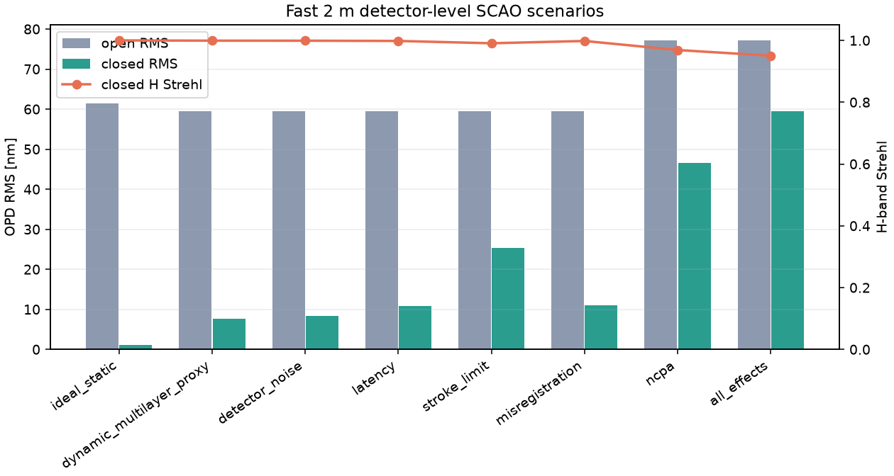
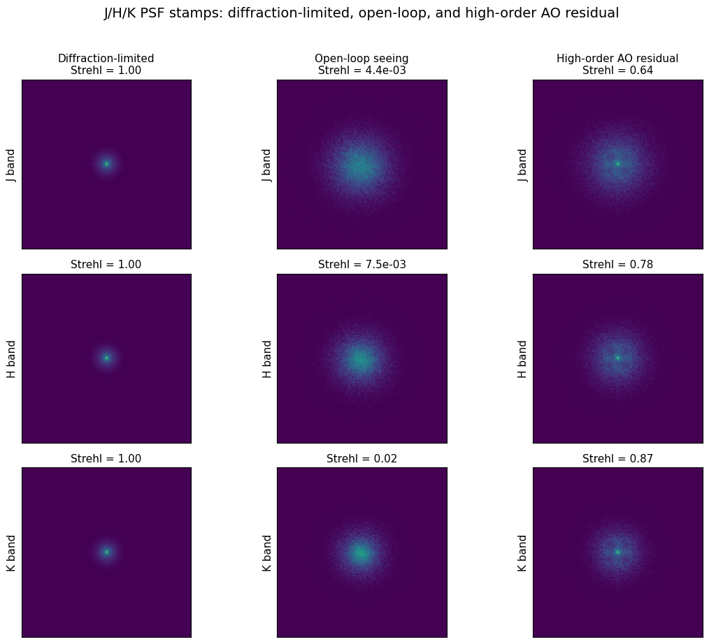
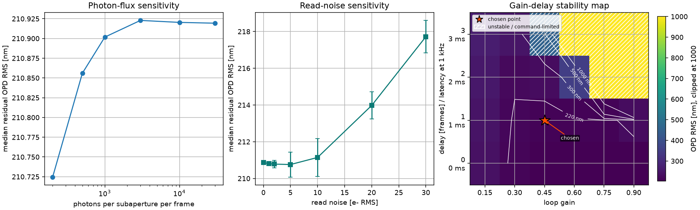
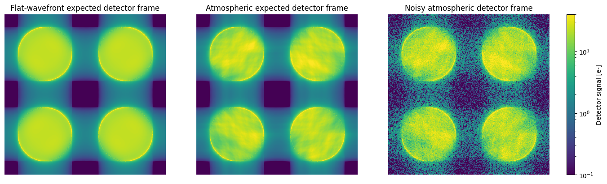

# Shack-Hartmann Adaptive-Optics Simulation

[](https://github.com/xhvoid/Shack-Hartmann-AO-Simulation/actions/workflows/ci.yml)

A modular Shack-Hartmann SCAO simulation framework with native and HCIPy
optical backends, custom detector and real-time-control modelling,
science-facing PSF diagnostics, and cross-backend physical validation.

The project makes the numerical path from pupil-plane aberration to WFS
measurement, reconstruction, deformable-mirror correction, residual OPD, and
science PSF inspectable. It is a research/portfolio framework, not an
observatory digital twin, a calibrated ESO instrument simulator, or an
operational AO pipeline.

## What the framework contains

- Geometric and detector-level Shack-Hartmann sensors with stable physical
  subaperture/row identities.
- Native NumPy atmosphere, mode, SH-WFS diffraction, DM, and science-PSF
  implementations.
- Optional HCIPy atmosphere, Gaussian DM, microlens/Fresnel SH-WFS, and
  Fraunhofer science-propagation adapters.
- Repository-owned detector effects, persistent detector realization,
  centroid estimators, and explicit validity gates.
- Modal or actuator interaction calibration; least-squares, TSVD, and
  Tikhonov reconstruction with runtime row masks and bounded factor caches.
- Typed command projection, applied-command-aware leaky integration, and one
  frame-exact latency owner.
- Physical-axis Strehl, FWHM, EE50/EE80, halo, and scalar bandpass diagnostics.
- Versioned profiles, named random domains, explicit provenance, governed
  artifact schemas, and native-versus-HCIPy validation.

## Quick start

Python 3.10 or newer is required. The package exposes `test`, `hcipy`, and
`notebook-test` extras; contributors may install the `test` extra from an
editable checkout, while released users install the corresponding extras from
the distribution. The commands below assume the `test` extra is already
available. Exact dependency resolution is frozen under `constraints/`.

The following native commands are executable documentation: CI parses this
entire fenced block and runs it against a built, non-editable wheel from a
temporary bundle with no `src/` or `.git` directory.

<!-- readme-smoke: native -->
```bash
python -c "import shwfs_ao; print(shwfs_ao.__version__)"
python -m pytest -q tests/core/test_types_contracts.py
AO_DEMO_OUTPUT_DIR=readme-smoke-output AO_DEMO_REFERENCE_METRICS=readme-smoke-output/fast_reference_metrics.json python examples/run_fast_integration.py
```

`run_fast_integration.py` preserves the frozen fast-integration behavior
through the canonical `shwfs_ao.experiments.integration` facade, then delegates
file creation to the canonical `shwfs_ao.io.artifacts` writer. The shared
canonical system builder and loop are under `shwfs_ao.experiments.scao` and
`shwfs_ao.control`.

For HCIPy, install the `hcipy` extra (or `test,hcipy` for validation). The
constrained HCIPy CI lane executes this separate wheel-installed block:

<!-- readme-smoke: hcipy -->
```bash
python examples/run_native_hcipy_validation.py
```

Every shell command in this README appears in an executable `bash` block with a
`readme-smoke` owner. The runner rejects an unowned block, so a
source-checkout-only command cannot be added silently. Development-only
installation, baseline, data-refresh, and notebook commands live in their
owning documentation pages rather than masquerading as portable quick-start
commands.

## Architecture at a glance

The shared pipeline uses optical path difference in SI units:

```text
atmosphere OPD (m)
  - DM correction OPD (m)
  = residual OPD (m)
  → WFS MeasurementVector with stable row IDs
  → mask-aware reconstruction
  → typed coordinate-to-actuator projection
  → gain/leak/latency controller
  → full-layout DM command in m OPD-equivalent
  → applied-command acknowledgement
  → residual OPD history and physical-axis PSF diagnostics
```

Phase is always tied to an explicit wavelength:

```python
phase_rad = 2.0 * np.pi * opd_m / wavelength_m
opd_m = phase_rad * wavelength_m / (2.0 * np.pi)
```

DM commands are positive OPD-equivalent correction amplitudes—not actuator
volts and not reflective surface displacement. The loop convention is:

```python
residual_opd_m = atmosphere_opd_m - dm_correction_opd_m
requested_commands_opd_m = leaked_commands_opd_m + gain * reconstructed_delta_opd_m
```

The HCIPy reflective-DM adapter converts OPD command to half-sized surface
displacement and lets reflection produce `2 * surface` OPD exactly once.

### Package map

| Package | Responsibility |
| --- | --- |
| `shwfs_ao.core` | wavefront units/validation, geometry, provenance, hashes, named RNG streams, public protocols and result types |
| `shwfs_ao.backends.native` | transparent NumPy atmosphere, modes, SH-WFS optics, DM synthesis, science propagation, native factory |
| `shwfs_ao.backends.hcipy` | lazy conversion and HCIPy component adapters; no detector/control/artifact policy |
| `shwfs_ao.detector` | configuration/realization, electron effects, centroiding, validity |
| `shwfs_ao.wfs.shack_hartmann` | lenslet geometry, reference calibration, detector/geometric sensors |
| `shwfs_ao.dm` | actuator IDs, OPD stroke/fault policy, requested/applied diagnostics |
| `shwfs_ao.calibration` | probe bases, interaction matrices, diagnostics, reconstructors |
| `shwfs_ao.control` | command mapping, gain/leak/latency, loop, history, sweeps |
| `shwfs_ao.science` | bandpasses, propagation selection, physical-axis metrics |
| `shwfs_ao.experiments` | profile construction, SCAO orchestration, conditioned/error-budget workflows |
| `shwfs_ao.validation` | physical estimators, governed regression, cross-backend comparison |
| `shwfs_ao.io` | strict profiles/public data/resources and explicit artifact writing |
| `shwfs_ao.experimental.pwfs` | exploratory PWFS forward model outside the stable SH-WFS contract |

Both the native and HCIPy backends are built-in SCAO component factories,
selected by a profile's `backend` field, so a `backend="hcipy"` configuration
builds the HCIPy system through the same public-protocol adapters that
cross-backend validation uses. Of the packaged profiles only
`high_order_10m_hcipy` selects HCIPy; the rest are native and need no optional
dependency to build. When the optional `hcipy` extra is not installed,
`build_scao_system()` raises the canonical `OptionalDependencyError` with its
install hint instead of silently falling back to native.

Five current-module diagrams—package dependencies, runtime data flow,
native/HCIPy boundary, calibration, and experiment/artifact flow—are in
[docs/architecture.md](docs/architecture.md). The exact protocol and result
field reference is in [docs/backends.md](docs/backends.md).

## Backends: shared and different responsibilities

| Behavior | Shared repository layer | Native | HCIPy |
| --- | --- | --- | --- |
| atmosphere interface | absolute-time, piston-removed OPD m | periodic Fourier frozen flow | finite/infinite von Kármán layers |
| SH-WFS output | normalized spots with stable IDs, then the same detector/centroid/validity chain | local padded FFT | microlens array + Fresnel propagation |
| DM policy | ordered IDs, stroke, dead/stuck, clipping, telemetry | multiple synthetic influence families | matched Gaussian reflective DM |
| real-time control | calibration, reconstruction, projection, gain/leak/latency | shared | shared |
| science result | unit-flux `PsfResult` with angular axes | centered padded FFT | Fraunhofer focal grid |

HCIPy objects never cross these boundaries. Native and HCIPy are compared
exactly for identity/units and shared fixtures, tightly for simple conversion
and sign checks, and through documented physical tolerances for optical or
closed-loop metrics. Independently generated atmospheres are compared
statistically, not pointwise. HCIPy usage alone is not observatory validation.

## Detector and control behavior

The detector path keeps optical propagation separate from electronics:

```text
unit-sum optical spot
→ source/background electron expectation
→ persistent pixel response
→ Poisson shot noise
→ Gaussian read noise
→ full-well and bad-pixel policy
→ centroid estimator
→ flux/SNR/uncertainty/clipping validity
```

Canonical profiles can hold persistent PRNU and bad-pixel maps in one
`DetectorRealization`. Frozen historical profiles retain the explicit
`per_frame_legacy` PRNU/draw-order mode until a separately reviewed numerical
change updates their baseline.

Invalid measurement rows stay invalid and may carry NaN; they are never
zero-filled. If too few rows are usable, reconstruction returns `None`. The
controller still advances its queue, enqueues a zero increment, permits leak,
and may release an older delayed command. After the DM clips or applies faults,
the controller is synchronized to the command actually applied.

## Profiles and notebooks

Packaged, versioned profiles include:

- `fast_2m_detector`;
- `portfolio_2m_detector`;
- `research_2m_detector`;
- `high_order_10m_geometric`; and
- `high_order_10m_hcipy` (requires the optional `[hcipy]` extra to build).

A profile name never means “latest defaults.” Backend selection does not
silently change seeing, photon budget, detector noise, or controller settings.

The current notebooks are thin research narratives over installed APIs:

- `notebooks/tutorials/` builds from wavefront/atmosphere through geometric
  and detector SH-WFS, TSVD, and shared closed-loop control.
- `notebooks/studies/` covers mode-order sampling, high-order SCAO,
  noise/latency/gain, detector-level 2 m SCAO, and native-versus-HCIPy
  comparison.
- `notebooks/experimental/pwfs_detector_level_atmosphere.ipynb` documents the
  exploratory PWFS path and its limits.
- `notebooks/legacy/original_notebooks/` is archived evidence, not the primary
  architecture or execution path.

Fast tutorials execute offline in CI from a non-editable wheel in a fresh
working directory. The disposition and seed policy for every original and
canonical notebook is recorded in `notebooks/notebook_manifest.json`.

## Provenance: public anchors versus synthetic AO

| Input/model | Classification | Interpretation |
| --- | --- | --- |
| ESO ASM cache | direct public data | conditions seeing/r0-style inputs; not a measured phase cube |
| SVO 2MASS J/H/Ks curves | direct public data | weights scalar wavelength diagnostics |
| Pan-STARRS/2MASS rows | direct public data | photometric anchors for an engineering photon estimate |
| atmosphere screens | synthetic or literature-inspired | generated wavefronts, even when public seeing conditions their amplitude |
| detector and WFS thresholds | synthetic/internal | not measured camera calibration |
| DM influences and interaction matrix | synthetic calibration | not a hardware poke matrix |
| controller/latency | compact simulation policy | not an operational RTC model |
| science PSFs | diagnostic propagation | trends, not calibrated throughput predictions |

See [docs/provenance.md](docs/provenance.md) and [DATA_LICENSES.md](DATA_LICENSES.md)
for the five source classes, structured fields, cache terms, and
redistribution caveats.

## Validation and reproducibility

Validation has four distinct levels:

1. exact interface/unit/sign/order and analytic component tests;
2. seeded native regression under frozen metric-specific tolerances;
3. native-versus-HCIPy exact, tight-numerical, physical-tolerance, and
   informational comparison levels; and
4. provenance/finiteness checks for conditioned scenarios.

The root seed is split into six stable named domains: detector realization,
detector shot noise, detector read noise, calibration, atmosphere, and NCPA.
The derivation scheme is versioned, keyed/scoped children do not perturb
unrelated persistent streams, and controlled sweeps reset random, atmosphere,
controller, and DM state per point.

Accepted baselines are read-only during ordinary work. Generation writes a
candidate and diff to an explicit separate directory; acceptance is a distinct
reviewed command requiring a reason and review reference. Schema-v2 artifacts
remain readable; schema 3 adds structured provenance/reproducibility,
component/layout hashes, CSV sidecars, and a content-addressed manifest. The
upgrader refuses to invent non-inferable metadata.

Details:

- [docs/validation.md](docs/validation.md)
- [docs/reproducibility.md](docs/reproducibility.md)
- [docs/artifact_schemas.md](docs/artifact_schemas.md)

## Compatibility and migration

AO-REF-021 Phase A deprecated the 19 installed root-level imports such as
`dm_model`, `reconstruction`, `shwfs_detector`, and `pwfs_forward`. Importing a
root shim emits `DeprecationWarning` with its canonical replacement and planned
removal release. `import shwfs_ao` and canonical subpackages remain silent.

The `shwfs_ao.legacy.*` namespace is the silent, non-canonical compatibility
layer for retained behavior adapters. It should be used only when no canonical
drop-in preserves a frozen public behavior. The generated
`ao_simulation_data` resource alias is also deprecated; read canonical packaged
resources through `shwfs_ao.io.resources`.

Nothing is deleted in Phase A. Root shims and resource aliases remain installed
until both the recorded time and release boundaries have elapsed; Phase B is a
separate major/boundary release with no numerical changes. The complete symbol
replacement map, deprecation clock, and serialized migration rules are in
[docs/migration.md](docs/migration.md).

## Selected outputs

These tracked figures illustrate the model's diagnostics, not calibrated
performance claims.







The PWFS images are exploratory only:



## Explicit limitations

- Not an observatory digital twin.
- Not calibrated to a specific ESO instrument.
- Synthetic DM influence functions and interaction calibration.
- Synthetic/internal detector assumptions and centroid-validity thresholds.
- Limited single-line-of-sight atmosphere; no complete scintillation or
  tomography model.
- PWFS branch experimental, not a validated PWFS control backend.
- No ELT LGS tomography, cone-effect, sodium-layer, multi-guide-star, or sky-
  coverage model.
- No claim that HCIPy usage or cross-backend agreement alone validates
  observatory performance.

## Documentation

- [Architecture](docs/architecture.md)
- [Backends and public contracts](docs/backends.md)
- [Validation](docs/validation.md)
- [Provenance](docs/provenance.md)
- [Reproducibility](docs/reproducibility.md)
- [Artifact schemas](docs/artifact_schemas.md)
- [Migration](docs/migration.md)
- [Documentation index](docs/README.md)

## Citation and license

Use [CITATION.cff](CITATION.cff) for citation metadata. Repository-authored
software and documentation are MIT licensed; third-party cached data retain the
terms and acknowledgement requirements summarized in
[DATA_LICENSES.md](DATA_LICENSES.md).
