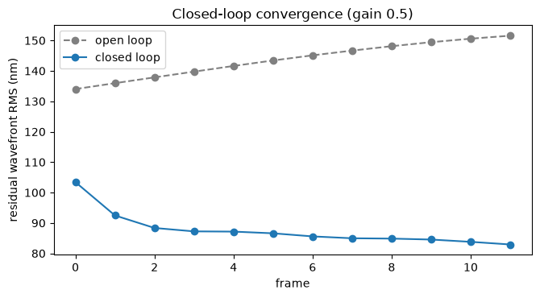
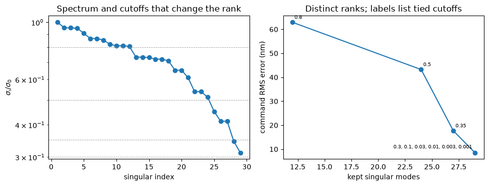
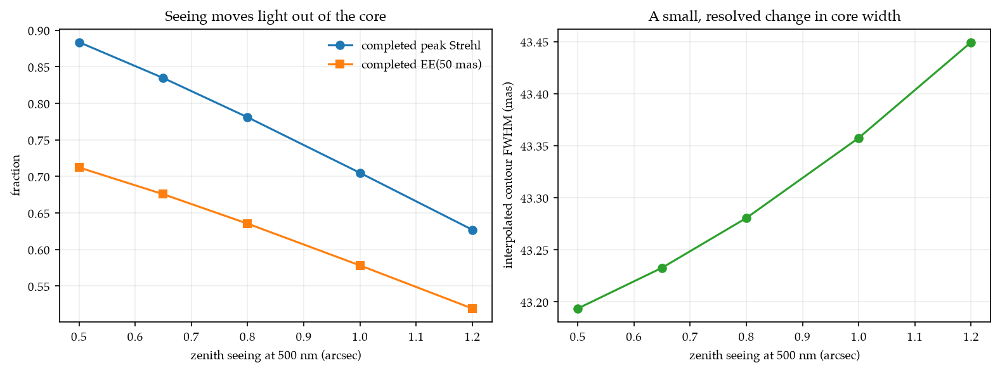

# Shack-Hartmann Wavefront Sensing & Adaptive Optics

[](https://github.com/xhvoid/Shack-Hartmann-AO-Simulation/actions/workflows/ci.yml)
[](pyproject.toml)
[](LICENSE)

**From optical wavefronts to detector measurements, calibrated reconstruction and closed-loop correction.**

A modular Shack-Hartmann SCAO simulation framework with native and HCIPy
optical backends, custom detector and real-time-control modelling,
science-facing PSF diagnostics, and cross-backend physical validation.

This Python project investigates how wavefront sensing, sampling, detector
noise, reconstruction and control choices affect adaptive-optics performance.
Its emphasis is an inspectable numerical chain: explicit physical units,
controlled experiments, quantitative diagnostics and reproducible results.

**Start here:** [sensor calibration](notebooks/tutorials/01_geometric_shwfs.ipynb)
· [reconstruction](notebooks/tutorials/03_tsvd_regularization.ipynb)
· [closed-loop control](notebooks/tutorials/04_closed_loop_control.ipynb)
· [installation](docs/getting_started.md)
· [technical documentation](docs/README.md)



*Current executed control tutorial: the open and corrected wavefront RMS are
compared over the same time samples. A short, noiseless synthetic example
shows the transient response; it does not establish a general performance limit.*

## Engineering focus

| Area | Implementation and evidence |
| --- | --- |
| Optical modelling | OPD/phase conversion, von Kármán frozen-flow turbulence, geometric and diffractive Shack-Hartmann sensing, Fourier PSF propagation |
| Sensor analysis | Reference calibration, photon/read noise, persistent detector response, centroid uncertainty and invalid-measurement handling |
| Reconstruction | Modal/actuator interaction matrices, singular-spectrum diagnostics, least squares, TSVD and Tikhonov regularization |
| Control | Leaky integration, explicit frame latency, actuator stroke/fault handling and feedback of the command actually applied |
| Numerical verification | Analytic fixtures, statistical atmosphere checks, sampling convergence, native/HCIPy comparisons and packaged regression baselines |
| Scientific software | Typed component interfaces, independent random streams, resource hashes, installed-wheel tests and automated notebook execution |

These exercises develop skills relevant to wavefront-sensor laboratory work:
connecting an optical model to measurements, calibrating response, analysing
residuals and testing numerical assumptions. The present implementation uses
Shack-Hartmann sensing and continuous synthetic mirrors. **ZEUS/Zernike
phase-contrast sensing, segmented-mirror co-phasing and MELT/ZIRCAM laboratory
data are outside its current scope.** Zernike modal expansions used here are
not a Zernike phase-contrast sensor.

## Selected results

The values below come from committed, executed notebooks. They describe the
specified synthetic experiments, not predicted ELT or instrument performance.

| Experiment | Recorded result | Interpretation |
| --- | --- | --- |
| [Sensor calibration](notebooks/tutorials/01_geometric_shwfs.ipynb) | A 2 µrad tilt produces 2.701 px displacement versus 2.902 px geometrically; measured/geometric gain **0.9305** | Finite spot windows change the measured response; calibration matters |
| [TSVD reconstruction](notebooks/tutorials/03_tsvd_regularization.ipynb) | Retaining 12, 24, 27 and 29 singular modes gives command RMS errors of **62.90, 43.37, 17.51 and 8.58 nm** | Cutoffs cross the measured spectrum; thresholds retaining the same rank tie in this realization |
| [Closed-loop control](notebooks/tutorials/04_closed_loop_control.ipynb) | Matched final-half wavefront RMS: **148.6 → 84.4 nm** | A 1 m, 500 Hz, gain-0.5 example with zero frame delay and detector noise disabled |
| [Correction-order comparison](notebooks/studies/high_order_scao.ipynb) | Common open-loop RMS **256.3 nm**; 5×5 / 7×7 / 9×9 DM grids give **246.7 / 229.6 / 227.5 nm** | Pupil sampling, 10×10 lenslet geometry and atmospheric trajectory are held fixed |
| [Gain and latency](notebooks/studies/noise_latency_gain.ipynb) | At two frames of delay, closed/open RMS rises from **0.723** at gain 0.2 to **1.746** at gain 1.0 | The 16-frame noiseless scan exposes amplification; it is not a formal stability boundary |



*Reconstruction error versus retained rank for one injected command and noise
realization. The full-rank cutoff settings are tied; the plot does not imply a
universally optimal regularization parameter.*

### System-level sensitivity with TIPTOP

A separate [TIPTOP/P3 and MASTSEL study](notebooks/studies/12_TIPTOP_performance_modelling.ipynb)
examines a representative **8 m, eight-LGS, three-DM** configuration at
**1.65 µm** across a **0–30 arcsec** science field. It complements the custom
time-domain simulator with analytical sensitivity modelling.

The study adds an explicitly documented continuous fitting-error tail to the
sampled P3 residual spectrum. The completed on-axis baseline gives **131.7 nm
residual WFE**, **0.781 peak Strehl**, and **0.635 encircled energy within
50 mas**. Increasing seeing from 0.5 to 1.2 arcsec reduces that encircled energy
by **27.1%**, even though the PSF core width changes only slightly.



The implementation retains raw upstream results alongside the completed
values, checks error-budget closure and independently varies frequency
quadrature, computational field and focal-pixel sampling. See the
[method and limitations](docs/notebook12_tiptop_portfolio_notes.md) and
[machine-readable validation results](notebooks/studies/tiptop_validation.json).
This is a restricted high-order analytical adapter, not an unmodified TIPTOP
prediction or a calibrated instrument model.

## Run the project

Follow the [installation and notebook guide](docs/getting_started.md) first.
The core requires Python **3.10+**; the optional TIPTOP study requires
**3.11+**. Native simulations run offline after dependencies are installed.

From the repository root in the configured environment:

<!-- readme-smoke: native -->
```bash
python -c "import shwfs_ao; print(shwfs_ao.__version__)"
python -m pytest -q tests/core/test_types_contracts.py
AO_DEMO_OUTPUT_DIR=readme-smoke-output AO_DEMO_REFERENCE_METRICS=readme-smoke-output/fast_reference_metrics.json python examples/run_fast_integration.py
```

The demonstration writes figures, tables and metrics to `readme-smoke-output/`.
It uses the fast **control-space proxy** described below. For the physical
wavefront experiments, start with the linked tutorials and studies.

After installing the optional HCIPy dependencies:

<!-- readme-smoke: hcipy -->
```bash
python examples/run_native_hcipy_validation.py
```

Both command blocks are exercised in CI against an installed wheel outside
the source checkout. [Locked environments](constraints/README.md) and
[replay rules](docs/reproducibility.md) document stronger reproducibility
requirements than a normal interactive installation.

## How the simulation is organized

```text
Atmospheric OPD ── subtract DM correction ──► residual wavefront
                                               │
                        ┌──────────────────────┴────────────────────┐
                        ▼                                           ▼
                 Shack-Hartmann optics                        Science PSF
                        ▼                                           ▼
               Detector + centroiding                    Strehl / FWHM / EE
                        ▼
             Validity-aware reconstruction
                        ▼
               Gain / leak / latency
                        ▼
              DM stroke and fault policy ──► next correction
```

Optical path difference is stored in **metres**, phase is tied to an explicit
wavelength, and DM commands are **OPD-equivalent correction amplitudes**.
Calibration preserves measurement-row and actuator identities. Invalid
measurements remain invalid; the controller advances time and synchronizes
its state with the command the mirror actually applies.

The NumPy/SciPy implementation lives in [src/shwfs_ao](src/shwfs_ao).
Optional [HCIPy](https://hcipy.org/) adapters supply alternative optical
components through the same interfaces; detector, reconstruction and control
policies remain shared. The supplemental study uses
[TIPTOP](https://github.com/astro-tiptop/TIPTOP),
[P3](https://github.com/astro-tiptop/P3) and
[MASTSEL](https://github.com/astro-tiptop/MASTSEL), with its local numerical
completion identified separately.

See [architecture](docs/architecture.md) for module diagrams and
[backend contracts](docs/backends.md) for units, signs and interfaces.

## Validation and model boundaries

Validation combines analytic component checks, seeded regression tests,
statistical turbulence checks and comparisons with an independent optical
backend. CI covers source and installed-wheel execution on Python 3.10 and
3.14, an HCIPy lane on Python 3.11, notebook smoke runs, lint and static types.
Agreement between implementations is evidence about the tested quantities;
it does not establish agreement with laboratory or on-sky measurements.

Recent numerical corrections include sub-cell atmospheric spectral
integration, exact subpixel frozen-flow replay and a radial PSF-width
estimator checked against analytic diffraction. The
[numerical verification record](docs/numerical_accuracy_fixes.md) documents
methods, tolerances, corrected results and remaining limitations.

<details>
<summary><strong>Interpreting the packaged regression baselines</strong></summary>

The fast integration test synthesizes disturbances within the DM's own
controllable space and therefore contains no fitting error. The physical
baseline uses a von Kármán atmosphere. Their `all_effects` rows are:

| Disturbance | Open-loop RMS | Closed-loop RMS | Closed/open | Peak Strehl J / H / K |
| --- | --- | --- | --- | --- |
| control-space proxy (`fast_*`) | 77.2 nm | 59.4 nm | 0.77 | 0.915 / 0.950 / 0.971 |
| von Kármán screen (`physical_*`) | 492.0 nm | 440.6 nm | 0.90 | 0.188 / 0.250 / 0.448 |

These are separate 12- and 24-frame regression fixtures, respectively. The
physical case deliberately stresses a 13-actuator synthetic DM with a
120 nm OPD stroke cap; its median tail frame has 10 saturated actuators.
It is not an optimized AO design. RMS removes piston but retains tilt;
peak Strehl follows the displaced PSF maximum. Band values are weighted
instantaneous scalar metrics summarized over tail frames, not a broadband
exposure image. [Baseline definitions and validation](docs/validation.md)
provide the complete interpretation.

</details>

The native time-domain model is single-line-of-sight SCAO, with synthetic DM
influences and detector assumptions. The TIPTOP study has its own restricted
multi-guide-star analytical scope. Neither is an observatory digital twin;
scintillation, full ELT geometry and measured hardware calibration are absent.
Public ESO atmospheric-monitoring data and SVO/catalogue inputs are attributed
in [provenance](docs/provenance.md) and [data licences](DATA_LICENSES.md).
The experimental PWFS and [archived notebooks](notebooks/legacy/original_notebooks)
are retained as research history, separate from current validated results.

## Explore further

- [Five tutorials](notebooks/tutorials): wavefronts, sensing, detector statistics, reconstruction and control.
- [Parameter studies](notebooks/studies): correction order, gain/delay, detector-level SCAO, native/HCIPy comparison and TIPTOP sensitivity.
- [Figure provenance](figures/README.md): current results versus historical plots.
- [Technical documentation](docs/README.md): validation, reproducibility, APIs and artifact schemas.

## Author, citation and licence

**Xu Han** · [Citation metadata](CITATION.cff) · [MIT licence](LICENSE)

Repository-authored software and documentation are MIT licensed. Third-party
software and cached data retain their own terms and acknowledgement
requirements, recorded in [DATA_LICENSES.md](DATA_LICENSES.md).
