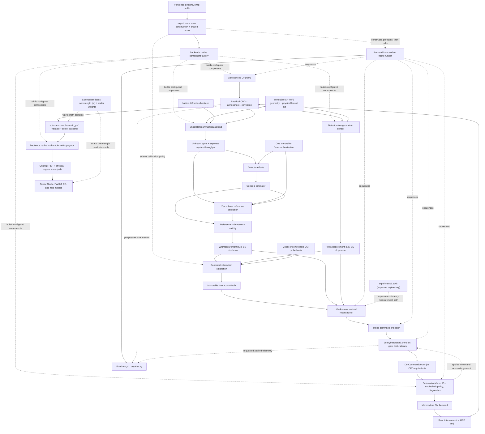

# Architecture

This document shows how the canonical component modules and compatibility
facades connect into the detector-level adaptive-optics pipeline. It is a
compact learning and portfolio project, not an observatory-grade AO simulator;
see the provenance and validation sections of the
[README](../README.md) for the real/estimated/synthetic boundary.

## Module pipeline



## Module responsibilities

| Module | Role |
| --- | --- |
| `data_sources.py` | Load and validate small public-data caches (ESO ASM snapshot, SVO 2MASS J/H/Ks curves, Pan-STARRS / 2MASS photometry) with units and `source_class`. |
| `atmosphere_profiles.py` | Seeing → r0 conversion and synthetic multi-layer / frozen-flow phase sequences. |
| `ao_conditions.py` | `ObservingConditionConfig` presets that set observing difficulty (seeing, photon budget, noise, latency, stroke, NCPA, misregistration) for public-data-informed runs. |
| `shwfs_ao.io.configs` | Strict schema-v1 loading and deterministic serialization for immutable, explicitly versioned SCAO profiles, nested policies, provenance, and scale/condition hashes. |
| `shwfs_ao.io.resources` | Importlib-only access to the checked canonical fixture/schema package, safe logical-name normalization, and deterministic resource-manifest verification without repository-root discovery. |
| `shwfs_ao.io.artifacts` | Caller-owned deterministic CSV/JSON/runtime/figure output, explicit schema-v2/v3 readers and upgrade, governed table sidecars/manifests, and baseline-authority validation. |
| `shwfs_ao.experiments.scao` | Backend selection, fail-closed interaction-matrix resolution, complete component construction/preflight, and the one public runner shared by geometric and detector-level profiles. |
| `shwfs_ao.backends.native.factory` | Native component factory that maps explicit profile values to atmosphere, geometric/detector WFS, DM, and science implementations without choosing observing defaults. |
| `shwfs_ao.core.geometry` | Immutable sampled pupil geometry with explicit metre coordinates; array axis 0 is physical y/row and axis 1 is physical x/column. |
| `shwfs_ao.wfs.shack_hartmann.geometry` | Immutable retained-lenslet masks, physical IDs, centers, and serialized ordering. |
| `shwfs_ao.wfs.shack_hartmann.optics` | Backend-neutral detector-plane sampling and strict spot-result boundary validation. |
| `shwfs_ao.backends.native.shwfs` | NumPy local-field extraction, piston removal, fixed padding, centered FFT diffraction, and window normalization; no detector or validity behavior. |
| `shwfs_ao.wfs.shack_hartmann.calibration` | Deterministic zero-phase references using the runtime optical, detector-response, realization, and centroid path without temporal shot/read draws. |
| `shwfs_ao.wfs.shack_hartmann.measurement` | OPD-to-phase, optical spots, detector effects, centroids, reference subtraction, validity, and typed detector telemetry. |
| `shwfs_ao.wfs.shack_hartmann.geometric` | Detector-free local OPD-gradient sensor using the same subaperture and row identity. |
| `shwfs_ao.detector` | Canonical detector configuration and persistent realization, typed frame effects, centroid estimators, and centroid-quality / validity policy. |
| `shwfs_ao.dm.config` | Frozen repository DM configuration, OPD-equivalent stroke/fault values, physical actuator-ID construction, and provenance. |
| `shwfs_ao.dm.model` | One repository-level DM wrapper owning identity/order validation, clipping, dead/stuck policy, diagnostics, metadata, and hashes. |
| `shwfs_ao.backends.native.dm` | Square-grid placement, Gaussian/compact/pyramid influence sampling, and finite raw OPD synthesis; no controller state or fault policy. |
| `shwfs_ao.backends.native.modes` | Finite real Zernike generation and the single sampled-pupil unit-RMS modal normalization implementation. |
| `shwfs_ao.calibration.interaction` | Modal/DM probe bases and shared central/forward WFS interaction calibration with full row identity, units, hashes, positive-residual sign, and scoped random streams. |
| `shwfs_ao.calibration.diagnostics` | Singular values, numerical rank, condition proxy, and zero-column checks using calibration-valid rows only. |
| `shwfs_ao.calibration.reconstructors` | Independent least-squares, TSVD, and Tikhonov inverse policies with exact runtime row/unit validation, full-layout masked results, matrix identity, and bounded mask-keyed factorization caches. |
| `shwfs_ao.control.config` | Immutable frame count, gain, leak, latency, frame rate, and root-seed contract with derived timing and deterministic identity. |
| `shwfs_ao.control.command_mapping` | Typed, hashed identity, controllable-subset, and calibrated modal-to-actuator increment projectors. |
| `shwfs_ao.control.controller` | The sole gain/leak/latency and command-state owner; each update starts from the command actually applied by the DM. |
| `shwfs_ao.control.loop` | Backend-independent frame sequencing, component identity checks, named-stream routing, residual convention, and history construction. |
| `shwfs_ao.control.history` | Immutable fixed-length SI telemetry, row masks, command histories, component hashes, signs, and random-stream provenance. |
| `shwfs_ao.control.sweeps` | Replay-safe gain, latency, photon, read-noise, and gain-delay scans with point-local state resets. |
| `shwfs_ao.science.bandpass` | Immutable metre wavelength axes, transmission, provenance, and normalized quadrature weights for scalar band summaries. |
| `shwfs_ao.science.propagation` | Backend-independent residual-OPD construction helper and immutable focal-sampling contract; it selects a backend but contains no FFT. |
| `shwfs_ao.backends.native.propagation` | Fixed-pupil NumPy `SciencePropagator` and the one native centered, padded FFT kernel returning physical `PsfResult` grids. |
| `shwfs_ao.backends.hcipy` | Lazy optional-dependency boundary: availability probe, versioned requirement, and the documented `OptionalDependencyError` install hint; never imported eagerly by any other module. |
| `shwfs_ao.backends.hcipy.conversion` | Validated repository↔HCIPy grid, field, aperture, and wavefront conversions with exact coordinates, C-order/x-fastest flattening, NaN-outside-pupil restoration, and strict in-pupil finiteness checked before the dependency is resolved. |
| `shwfs_ao.science.metrics` | Physical-axis scalar Strehl, Marechal, FWHM, EE50/EE80, halo, lambda/D, and arcsecond metrics with explicit flux semantics. |
| `synthetic_instrument_data.py` | Compatibility-facing SH-WFS geometry, reference-centroid calibration, and detector-level measurement orchestration. |
| `shwfs_detector.py` | Compatibility-facing lenslet diffraction spots and finite detector windows; detector and centroid calls delegate to `shwfs_ao.detector`. |
| `dm_model.py` | Historical nanometre-facing DM facade; physical construction and synthesis delegate to the canonical DM/native backend. |
| `interaction_matrix.py` | Compatibility result/scaling for poke matrices and inverse diagnostics; calibration, reconstruction, and rcond scans delegate to `shwfs_ao.calibration`. |
| `ao_closed_loop.py` | Frozen nanometre-facing compatibility facade; behavior-compatible control execution delegates to `shwfs_ao.control` and it owns no production loop engine. |
| `ao_diagnostics.py` | Frozen nanometre-facing compatibility facade for science bandpasses and J/H/K scalar metric rows; canonical work delegates to `shwfs_ao.science`. |
| `shwfs_ao.experiments.error_budget` | Canonical scenario matrix (atmosphere, detector noise, latency, stroke, misregistration, NCPA, all-effects) producing per-scenario OPD/Strehl/centroid metrics. |
| `ao_error_budget.py` | Frozen installed compatibility facade over `shwfs_ao.experiments.error_budget`. |
| `ao_validation.py` | Internal sanity checks (Marechal consistency, diffraction scale, photon/read-noise/latency trends, DM-fitting trend, reproducibility). |
| `ao_integration.py` | Compatibility orchestration for `IntegrationConfig` modes; execution completes in memory and only the retained write flag lazily delegates to `shwfs_ao.io.artifacts`. |
| `shwfs_ao.experimental.pwfs` | One installed owner for the frozen exploratory Fourier-optics PWFS model; it is outside the stable SH-WFS protocol boundary. |

## Shack-Hartmann invariants

The canonical geometry uses physical lenslet IDs, not a backend's enumeration.
The frozen ordering is serialized into calibration metadata, with two rows per
subaperture in `S:x`, then `S:y` order. Detector coordinates are absolute array
coordinates: positive x points toward increasing columns and positive y toward
increasing rows. The native backend's phase conversion is
`2π * residual_opd_m / wfs_wavelength_m`; pure positive x/y OPD tilts retain
that sign in spots, centroid shifts, and geometric slopes.

Each optical backend returns exactly one non-negative, unit-sum full-window
spot for every geometry ID. Window capture throughput is a separate value and
is never folded into the normalized spot twice. Missing, duplicated, or
reordered IDs fail before detector effects run.

The detector-level sensor owns one immutable detector realization. Its hash is
verified by both the reference calibration and runtime measurement. Persistent
pixel response and bad-pixel maps therefore remain fixed. Historical
per-frame PRNU calibration draws use explicitly keyed children of the
`calibration` random domain and record that identity in hashed provenance;
runtime shot/read streams remain caller-owned and untouched. Disabling runtime
noise disables temporal shot/read draws, not fixed response or the keyed
legacy calibration response.

The existing top-level `shwfs_detector` and `synthetic_instrument_data` imports
remain compatibility facades over these canonical owners. `pwfs_forward`
similarly delegates to `shwfs_ao.experimental.pwfs`; PWFS is deliberately not
advertised as an implementation of the Shack-Hartmann protocol.

## Deformable-mirror invariants

Repository DM commands have the exact unit `m_opd_equivalent`. They describe
positive correction OPD amplitudes: a positive command applied to a positive
influence function produces positive correction, and the residual is always

```python
residual_opd_m = atmosphere_opd_m - dm_correction_opd_m
```

The full `actuator_ids` tuple is immutable and must match every command exactly
in both identity and order. `controllable_actuator_ids` is the stable ordered
subset after excluding dead and stuck actuators. The wrapper records requested
commands, clips against the symmetric OPD-equivalent stroke, forces dead
actuators to zero, then forces stuck actuators to their configured clipped
value. Saturation diagnoses requested commands beyond stroke before either
fault rule.

The backend receives only the applied array. It returns a finite,
two-dimensional raw correction-OPD array in metres without piston removal. It has
no latency queue, gain, leak, command history, or actuator-fault state. A
reflective backend that accepts physical surface displacement converts a
canonical command to half that surface displacement; reflection then produces
twice the surface displacement in OPD. Applying either conversion again would
be a factor-of-two error.

DM configuration hashes cover the repository policy, sampled geometry,
ordered actuator layout, backend/influence configuration, command convention,
and provenance. Compatibility fields named in nanometres remain explicitly
OPD-equivalent and are converted once at the canonical boundary.

## Interaction-matrix invariants

`shwfs_ao.calibration` is the only repository owner of modal and DM/WFS
finite-difference calibration. Modal coordinates are piston-free, sampled
unit-pupil-RMS modes in `m_opd_rms`. DM coordinates are the canonical ordered
controllable-actuator subset in `m_opd_equivalent`; dead and stuck actuators
are excluded instead of represented by zero columns.

Every column describes WFS response to a positive residual-aberration OPD.
For a DM probe, its positive correction influence is presented as a positive
synthetic residual; the physical loop applies the correction later through
`atmosphere - correction`. Central calibration uses exact `(+a - -a)/(2a)`;
forward calibration uses one noise-free zero-OPD reference.

An interaction matrix retains the sensor's complete ordered row layout. A row
must be valid and finite for every required coordinate/sign/repeat or its full
matrix row is NaN and `row_valid` is false. Diagnostics use only valid rows.
Every sample receives a named stream beneath a `calibration` scope, isolating
calibration draws from top-level runtime detector and atmosphere generators.
The result hashes its row and coordinate layouts, physical units, diagnostics,
component identities, uncertainty, stream provenance, and sign convention.

## Reconstructor invariants

Interaction calibration owns the forward operator; reconstruction owns its
inverse policy. `LeastSquaresReconstructor`, `TsvdReconstructor`, and
`TikhonovReconstructor` consume an immutable `InteractionMatrix` and return the
shared `ReconstructionEstimate`. They preserve the matrix's coordinate IDs,
kind, unit, measurement unit, and hash instead of interpreting an array as DM
commands by position.

A runtime `MeasurementVector` must have exactly the calibrated row IDs in the
same order and the calibrated measurement unit. Its usable mask is the
intersection of calibration validity, runtime validity, and finite runtime
values. The valid-fraction denominator contains only calibration-valid rows.
Structural mismatches raise; a valid measurement returns `None` only when its
usable coverage or masked rank is below policy.

Solves use only compressed usable rows. Reconstructed and residual signals are
then expanded to the full canonical layout with NaN in unusable rows, never
with fabricated zero measurements. Masked operators and solve factors are
cached by matrix hash, reconstructor settings, and packed row mask in a
deterministic bounded LRU, so recurring detector masks do not cause an SVD on
every loop frame. Rcond scans call this same layer rather than implementing a
second pseudoinverse.

## Control-loop invariants

`shwfs_ao.control` is the only repository owner of production loop sequencing
and control latency. At frame `k`, the runner samples atmosphere once at
`k / frame_rate_hz`; current-DM and updated-DM residuals use that same truth
sample and always compute `atmosphere_opd_m - dm_correction_opd_m`. The runner
contains no optics, centroid, DM spatial, or matrix-inverse kernel.

The controller enqueues one full-layout increment per frame. A configured
latency of `d` releases the increment measured at `k - d`, so a frame-`k`
measurement first affects frame `k + d`. An unusable reconstruction enqueues
an exact zero without pausing the queue; older increments can still emerge and
leak still applies. After stroke and fault policy, the DM-applied command is
acknowledged to the controller and becomes the state for its next update.

Reconstruction coordinates cross an explicit `CommandProjector`; their kind,
unit, ordered IDs, matrix identity, and output actuator layout must agree.
Neither modal coefficients nor controllable-subset coordinates are silently
treated as a full actuator vector. Actuator interaction matrices and calibrated
modal projectors are bound to the target DM configuration hash. Controller and
DM commands use `m_opd_equivalent` throughout.

Every history has a fixed frame count, full requested/applied command arrays,
and full calibration-row masks. Measurement validity divides by the
calibration-valid row count, while subaperture validity divides by retained
subapertures whose layout cannot change between frames. The loop receives one
named `RandomStreams` provider whose root seed matches `LoopConfig`; stochastic
atmosphere roots must agree and their actual realization stream is recorded
when exposed. The loop does not derive ad hoc component generators.
Sweeps reset random, atmosphere, controller, and DM state for each point, which
makes their results independent of axis order.

## Science-propagation invariants

`shwfs_ao.science` owns science bandpasses, the backend-independent propagation
construction contract, and scalar image-quality metrics.
`shwfs_ao.backends.native.propagation` separately owns the one native NumPy
science FFT. Propagation consumes the loop's residual OPD in metres and applies
each science wavelength explicitly; WFS phase at the sensing wavelength is not
a valid substitute. The native propagator binds immutable pupil geometry and
sampling policy at construction so those coordinates cannot drift between
frames.

The native centered FFT returns a `PsfResult` normalized as unit-total
discrete pixel flux. Its x and y axes are strictly increasing physical angles
in radians matching columns and rows, and its metadata records pupil and focal
sampling, padding, cropping, interpolation, FFT convention, and normalization.
Encircled energy and halo fraction integrate discrete flux on those physical
axes. FWHM first converts flux to angular surface brightness using the physical
cell solid angle. Radians, arcseconds, and lambda/D are explicit conversions;
raw pixel indices never define the angular scale.

Bandpass weights are immutable wavelength quadrature for scalar summaries.
`band_average_scalar_metrics` averages monochromatic scalar values only and
does not stack PSF arrays. Broadband image coaddition requires a future API
with an explicitly supplied common angular grid, flux-conserving resampling,
and recorded interpolation provenance.

Historical `psf_tools` and `ao_diagnostics` imports retain their frozen
phase-facing or nanometre-facing signatures and result formats. They are
compatibility facades over the canonical science contract and native FFT
owner, not alternative public science engines.

## Input boundary

Inputs split into two clearly separated categories:

- **Public caches** flow through `data_sources.py` and condition selected inputs
  (atmosphere amplitude, science bandpasses, photon-budget anchors).
- **Synthetic / literature-inspired presets** drive every internal AO term (DM,
  interaction matrix, reconstructor, controller/latency, NCPA,
  misregistration, detector noise). These are engineering proxies, not
  measured observatory calibration or RTC telemetry.

The purpose of this diagram is to show that the repository is a coherent
detector-level AO pipeline — measurement → interaction matrix → reconstruction
→ typed command projection → controller → DM → residual OPD → science PSF —
rather than a collection of disconnected scripts.
