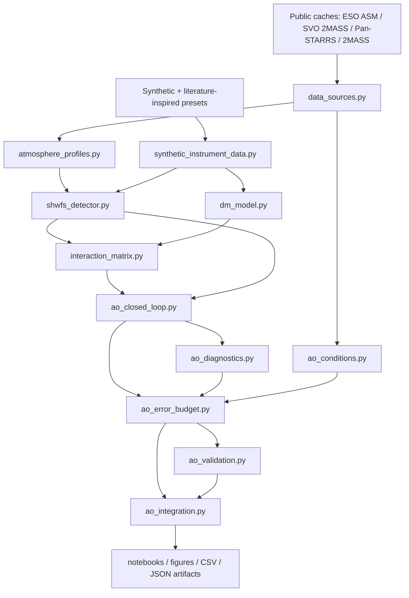

# Architecture

This document shows how the modules connect into one detector-level adaptive-optics
pipeline, from public/synthetic inputs through to notebooks, figures, and CSV/JSON
artifacts. It is a compact learning and portfolio project, not an observatory-grade
AO simulator; see the provenance and validation sections of the
[README](../README.md) for the real/estimated/synthetic boundary.

## Module pipeline

## Module responsibilities

| Module | Role |
| --- | --- |
| `data_sources.py` | Load and validate small public-data caches (ESO ASM snapshot, SVO 2MASS J/H/Ks curves, Pan-STARRS / 2MASS photometry) with units and `source_class`. |
| `atmosphere_profiles.py` | Seeing → r0 conversion and synthetic multi-layer / frozen-flow phase sequences. |
| `ao_conditions.py` | `ObservingConditionConfig` presets that set observing difficulty (seeing, photon budget, noise, latency, stroke, NCPA, misregistration) for public-data-informed runs. |
| `synthetic_instrument_data.py` | Detector and SH-WFS geometry config, reference-centroid calibration, detector presets, the detector-level measurement, and centroid-quality / validity diagnostics. |
| `shwfs_detector.py` | Lenslet diffraction spots, finite detector window, noise model, and centre-of-gravity centroiding. |
| `dm_model.py` | Synthetic DM influence functions (Gaussian / compact / pyramid-like), command-to-phase synthesis, stroke and dead-actuator handling. |
| `interaction_matrix.py` | Central-difference detector-level poke matrix, singular-value diagnostics, TSVD reconstruction, and rcond / poke-amplitude / noise-amplification scans. |
| `ao_closed_loop.py` | Compact integrator loop with gain, delay, leak, stroke clipping, command history, and per-frame valid-centroid fraction. |
| `ao_diagnostics.py` | Science bandpasses and J/H/K PSF metrics (Strehl, FWHM, EE50/EE80) from residual OPD. |
| `ao_error_budget.py` | Scenario matrix (atmosphere, detector noise, latency, stroke, misregistration, NCPA, all-effects) producing per-scenario OPD/Strehl/centroid metrics. |
| `ao_validation.py` | Internal sanity checks (Marechal consistency, diffraction scale, photon/read-noise/latency trends, DM-fitting trend, reproducibility). |
| `ao_integration.py` | `IntegrationConfig` modes (numerical scale) and the fast 2 m detector-level integration that ties the chain together and writes reference metrics. |

## Input boundary

Inputs split into two clearly separated categories:

- **Public caches** flow through `data_sources.py` and condition selected inputs
  (atmosphere amplitude, science bandpasses, photon-budget anchors).
- **Synthetic / literature-inspired presets** drive every internal AO term (DM,
  interaction matrix, reconstructor, latency, NCPA, misregistration, detector
  noise). These are engineering proxies, not measured observatory calibration.

The purpose of this diagram is to show that the repository is a coherent
detector-level AO pipeline — measurement → interaction matrix → controller →
residual OPD → science PSF — rather than a collection of disconnected scripts.
