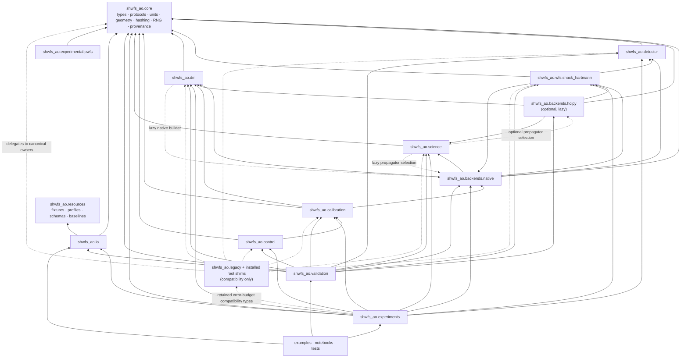
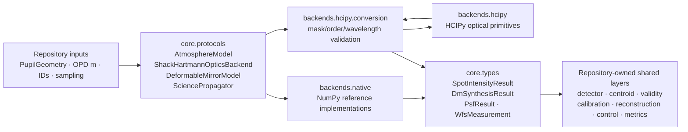
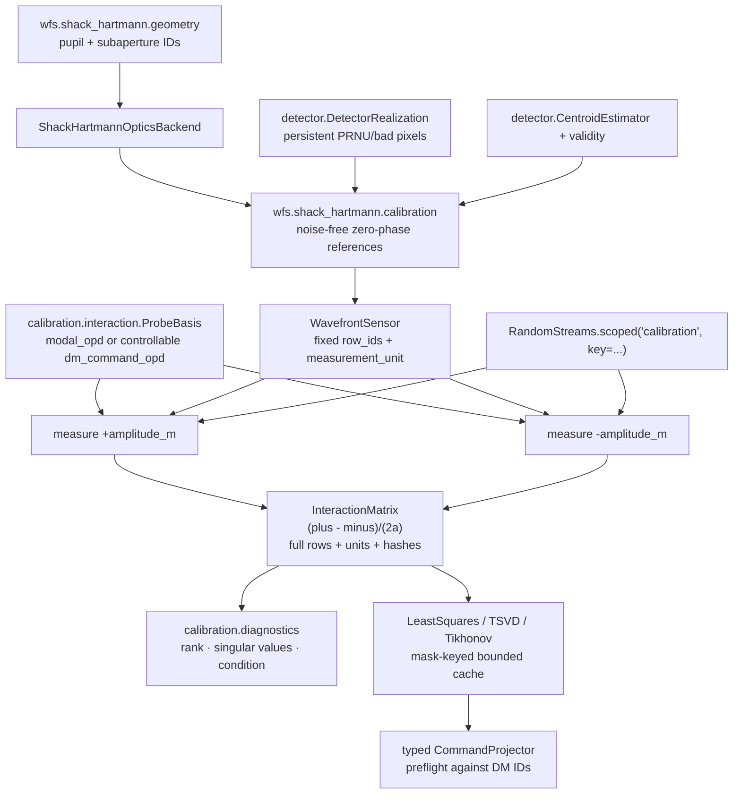

# Architecture

`shwfs_ao` is a modular Shack-Hartmann single-conjugate adaptive-optics
(SCAO) simulation framework. The canonical pipeline exchanges repository-owned
NumPy arrays and immutable result records; native and optional HCIPy code sit
behind those contracts. This is an inspectable research and portfolio model,
not an observatory digital twin or a calibrated instrument simulator.

The internal physical convention is deliberately narrow:

| Quantity | Canonical representation |
| --- | --- |
| atmospheric aberration and residual wavefront | OPD in metres |
| DM commands | OPD-equivalent correction amplitude in metres |
| wavelength and sampled pupil coordinates | metres |
| time | seconds |
| detector signal | electrons; detector positions in pixels |
| focal-plane coordinates | radians |
| report-only conversions | nm, arcsec, mas, or `lambda/D` |

Phase is never wavelength-free:

```python
phase_rad = 2.0 * np.pi * opd_m / wavelength_m
opd_m = phase_rad * wavelength_m / (2.0 * np.pi)
```

Positive DM commands create positive correction OPD. The loop always forms
`residual_opd_m = atmosphere_opd_m - dm_correction_opd_m`; see
[Backends](backends.md) for the reflective-surface factor-of-two boundary.

## 1. Package dependency diagram

Arrows mean “may import or construct from”; dashed arrows are lazy, optional,
or compatibility-only paths. `core` has no dependency on a backend, detector,
experiment, plotting library, resource loader, or artifact writer. Cycles at
the adapter/factory level are visible rather than hidden: shared contracts
remain in `core`, while backend builders may import the repository-owned
geometry, DM, detector, or science configuration they adapt.


```mermaid
flowchart BT
    CORE["shwfs_ao.core<br/>types · protocols · units · geometry · hashing · RNG · provenance"]
    NATIVE["shwfs_ao.backends.native"]
    HCIPY["shwfs_ao.backends.hcipy<br/>(optional, lazy)"]
    DETECTOR["shwfs_ao.detector"]
    WFS["shwfs_ao.wfs.shack_hartmann"]
    DM["shwfs_ao.dm"]
    CAL["shwfs_ao.calibration"]
    CONTROL["shwfs_ao.control"]
    SCIENCE["shwfs_ao.science"]
    EXPERIMENTS["shwfs_ao.experiments"]
    VALIDATION["shwfs_ao.validation"]
    IO["shwfs_ao.io"]
    RESOURCES["shwfs_ao.resources<br/>fixtures · profiles · schemas · baselines"]
    CLIENTS["examples · notebooks · tests"]
    EXPERIMENTAL["shwfs_ao.experimental.pwfs"]
    LEGACY["shwfs_ao.legacy + installed root shims<br/>(compatibility only)"]

    NATIVE --> CORE
    NATIVE --> DETECTOR
    NATIVE --> WFS
    NATIVE --> DM
    NATIVE --> SCIENCE
    HCIPY --> CORE
    HCIPY --> WFS
    HCIPY --> DM
    HCIPY --> SCIENCE
    DETECTOR --> CORE
    WFS --> CORE
    WFS --> DETECTOR
    WFS --> NATIVE
    DM --> CORE
    DM -. "lazy native builder" .-> NATIVE
    CAL --> CORE
    CAL --> DM
    CAL --> NATIVE
    CONTROL --> CORE
    CONTROL --> CAL
    SCIENCE --> CORE
    SCIENCE -. "lazy propagator selection" .-> NATIVE
    SCIENCE -. "optional propagator selection" .-> HCIPY
    EXPERIMENTS --> CORE
    EXPERIMENTS --> NATIVE
    EXPERIMENTS --> DETECTOR
    EXPERIMENTS --> WFS
    EXPERIMENTS --> DM
    EXPERIMENTS --> CAL
    EXPERIMENTS --> CONTROL
    EXPERIMENTS --> SCIENCE
    EXPERIMENTS --> IO
    VALIDATION --> CORE
    VALIDATION --> NATIVE
    VALIDATION --> HCIPY
    VALIDATION --> DETECTOR
    VALIDATION --> WFS
    VALIDATION --> DM
    VALIDATION --> CAL
    VALIDATION --> CONTROL
    VALIDATION --> SCIENCE
    VALIDATION --> IO
    IO --> CORE
    IO --> RESOURCES
    CLIENTS --> EXPERIMENTS
    CLIENTS --> VALIDATION
    CLIENTS --> IO
    EXPERIMENTAL --> CORE
    EXPERIMENTS -. "retained error-budget compatibility types" .-> LEGACY
    LEGACY -. "delegates to canonical owners" .-> CORE
    LEGACY -.-> DETECTOR
    LEGACY -.-> WFS
    LEGACY -.-> DM
    LEGACY -.-> CAL
    LEGACY -.-> CONTROL
    LEGACY -.-> SCIENCE
```

`core`, the shared SCAO builder/loop, and new backend-independent components do
not import `shwfs_ao.legacy`. The retained
`shwfs_ao.experiments.error_budget` compatibility workflow still accepts
historical loop/DM/calibration result types and therefore imports thin legacy
adapters; it is not a second physical engine. The legacy namespace contains
behavior-compatibility adapters, and the installed root-level modules are
deprecated shims during the AO-REF-021 compatibility window. New work uses the
canonical shared SCAO contracts directly.

## Module ownership

| Package | Owns | Does not own |
| --- | --- | --- |
| `shwfs_ao.core` | strict OPD/phase conversion, masked wavefront operations, immutable result types, component protocols, pupil geometry, provenance, hashes, named RNG streams | detector physics, propagation, control, files |
| `shwfs_ao.backends.native` | transparent NumPy atmosphere, Zernike modes, SH-WFS diffraction, DM spatial synthesis, science FFT propagation, native SCAO component factory | detector effects, validity, controller state, artifacts |
| `shwfs_ao.backends.hcipy` | lazy repository↔HCIPy conversion and HCIPy atmosphere, Gaussian DM, SH-WFS optics, and Fraunhofer science propagation adapters | detector/centroid policy, stroke/fault policy, latency, artifact writing |
| `shwfs_ao.detector` | detector configuration and realization, electron expectations/noise/effects, centroid estimators, validity policy | lenslet optics, control |
| `shwfs_ao.wfs.shack_hartmann` | lenslet geometry and IDs, backend-result validation, zero-phase reference calibration, geometric and detector-level sensors | detector-effect implementation, reconstruction, control |
| `shwfs_ao.dm` | actuator IDs/order, OPD-equivalent stroke and fault policy, requested/applied telemetry | backend optical synthesis, latency |
| `shwfs_ao.calibration` | probe bases, finite-difference interaction calibration, diagnostics, mask-aware reconstructors | controller integration |
| `shwfs_ao.control` | typed command projection, gain/leak, sole latency queue, applied-command acknowledgement, loop sequencing, history, replay-safe sweeps | optical kernels, artifact writing |
| `shwfs_ao.science` | wavelength quadrature, propagation selection, physical-axis PSF metrics | detector effects, controller state |
| `shwfs_ao.experiments` | versioned-profile assembly, preflight identity checks, shared SCAO runner, conditioned scenarios, and a retained legacy-shape error-budget adapter | new low-level physics kernels, output paths |
| `shwfs_ao.validation` | physical estimators, regression governance, native-versus-HCIPy comparison | baseline mutation during ordinary runs |
| `shwfs_ao.io` | strict profile/public-data/resource loading and explicit artifact serialization | physical propagation or control |
| `shwfs_ao.experimental.pwfs` | frozen exploratory PWFS forward model | stable SH-WFS protocol conformance or validated PWFS control |

`build_scao_system()` currently has a built-in native profile factory. Optional
factories may be registered explicitly; an unknown or unregistered backend
fails closed and never falls back to native. HCIPy component adapters are used
directly by cross-backend validation, and science propagation also exposes the
registered `backend="hcipy"` path.

## 2. AO runtime data flow

The frame runner is backend-independent. It samples atmospheric truth once per
frame, reconstructs only usable named rows, acknowledges the command actually
applied by the DM, and records fixed-layout SI telemetry.


```mermaid
flowchart LR
    CONFIG["io.configs.SystemConfig<br/>versioned profile + root seed"]
    BUILD["experiments.scao.build_scao_system<br/>identity preflight"]
    STREAMS["core.random.NamedRandomStreams"]
    ATM["AtmosphereModel.opd_at(time_s)<br/>atmosphere_opd_m"]
    DM["DeformableMirrorModel<br/>applied correction_opd_m"]
    RESIDUAL["residual_opd_m<br/>atmosphere - correction"]
    WFS["WavefrontSensor.measure"]
    MEAS["WfsMeasurement / MeasurementVector<br/>stable row_ids + valid_rows"]
    RECON["Reconstructor.reconstruct<br/>calibration-valid ∩ runtime-valid ∩ finite"]
    EST["ReconstructionEstimate or None"]
    PROJECT["CommandProjector.project<br/>typed coordinates → full actuator layout"]
    CTRL["Controller.update<br/>gain · leak · sole latency queue"]
    REQUEST["requested DmCommandVector"]
    APPLIED["DmSynthesisResult<br/>requested/applied + saturation"]
    ACK["Controller.accept_applied_commands"]
    HISTORY["control.history.LoopHistory"]
    SCIENCE["SciencePropagator.psf_from_opd"]
    PSF["PsfResult<br/>unit flux + angular axes"]
    METRICS["science.metrics<br/>Strehl · FWHM · EE50/80 · halo"]

    CONFIG --> BUILD
    BUILD --> STREAMS
    BUILD --> ATM
    BUILD --> WFS
    BUILD --> RECON
    BUILD --> PROJECT
    BUILD --> CTRL
    BUILD --> DM
    STREAMS --> ATM
    STREAMS --> WFS
    ATM --> RESIDUAL
    DM --> RESIDUAL
    RESIDUAL --> WFS --> MEAS --> RECON --> EST
    EST --> PROJECT --> CTRL --> REQUEST --> DM --> APPLIED --> ACK --> CTRL
    RESIDUAL --> HISTORY
    MEAS --> HISTORY
    APPLIED --> HISTORY
    RESIDUAL -. "separate post-loop call" .-> SCIENCE --> PSF --> METRICS
```

If the reconstructor returns `None`, the controller enqueues a zero increment,
advances time, releases any older delayed increment, and applies configured
leak. The frame does not become a zero-valued valid measurement and does not
pause the queue. After clipping/dead/stuck policy, `accept_applied_commands()`
synchronizes controller state to the applied command.

Science propagation is not executed inside `control.loop.run_closed_loop`;
callers pass a selected residual OPD to the configured propagator after or
alongside loop analysis.

SH-WFS row order is immutable: for each retained physical subaperture ID `S`,
the rows are `S:x` then `S:y`. Positive x/y OPD tilts retain their sign through
native or HCIPy optics, detector columns/rows, reference subtraction, and the
geometric sensor.

## 3. Native and HCIPy backend boundary

Only repository-owned contracts cross the boundary. HCIPy grids, fields,
wavefronts, propagators, and actuator arrays are private to
`shwfs_ao.backends.hcipy`.


```mermaid
flowchart LR
    REPOIN["Repository inputs<br/>PupilGeometry · OPD m · IDs · sampling"]
    PROTOCOLS["core.protocols<br/>AtmosphereModel<br/>ShackHartmannOpticsBackend<br/>DeformableMirrorModel<br/>SciencePropagator"]
    NATIVE["backends.native<br/>NumPy reference implementations"]
    CONVERT["backends.hcipy.conversion<br/>mask/order/wavelength validation"]
    HCIPY["backends.hcipy<br/>HCIPy optical primitives"]
    RESULTS["core.types<br/>SpotIntensityResult<br/>DmSynthesisResult<br/>PsfResult · WfsMeasurement"]
    SHARED["Repository-owned shared layers<br/>detector · centroid · validity<br/>calibration · reconstruction · control · metrics"]

    REPOIN --> PROTOCOLS
    PROTOCOLS --> NATIVE --> RESULTS
    PROTOCOLS --> CONVERT --> HCIPY --> CONVERT --> RESULTS
    RESULTS --> SHARED
```

The native backend is the transparent reference path, not a pixel truth model.
HCIPy is an independently implemented optical path, not proof of observatory
performance. Exact comparisons are restricted to identity, units, ordering,
conversion, and deliberately shared fixtures; optical morphology and closed-loop
trends use documented physical tolerances. See [Backends](backends.md) and
[Validation](validation.md).

## 4. Calibration workflow

Interaction calibration and reconstruction are separate responsibilities. The
calibrator always retains the sensor's complete row layout, even when some
rows are unusable.


```mermaid
flowchart TD
    GEOMETRY["wfs.shack_hartmann.geometry<br/>pupil + subaperture IDs"]
    OPTICS["ShackHartmannOpticsBackend"]
    REALIZATION["detector.DetectorRealization<br/>persistent PRNU/bad pixels"]
    CENTROID["detector.CentroidEstimator + validity"]
    REFERENCE["wfs.shack_hartmann.calibration<br/>noise-free zero-phase references"]
    SENSOR["WavefrontSensor<br/>fixed row_ids + measurement_unit"]
    BASIS["calibration.interaction.ProbeBasis<br/>modal_opd or controllable dm_command_opd"]
    STREAMS["RandomStreams.scoped('calibration', key=...)"]
    PLUS["measure +amplitude_m"]
    MINUS["measure -amplitude_m"]
    MATRIX["InteractionMatrix<br/>(plus - minus)/(2a)<br/>full rows + units + hashes"]
    DIAG["calibration.diagnostics<br/>rank · singular values · condition"]
    RECON["LeastSquares / TSVD / Tikhonov<br/>mask-keyed bounded cache"]
    PROJECTOR["typed CommandProjector<br/>preflight against DM IDs"]

    GEOMETRY --> OPTICS --> REFERENCE
    REALIZATION --> REFERENCE
    CENTROID --> REFERENCE --> SENSOR
    BASIS --> PLUS
    BASIS --> MINUS
    SENSOR --> PLUS
    SENSOR --> MINUS
    STREAMS --> PLUS
    STREAMS --> MINUS
    PLUS --> MATRIX
    MINUS --> MATRIX
    MATRIX --> DIAG
    MATRIX --> RECON --> PROJECTOR
```

Modal coordinates are `m_opd_rms`; DM coordinates are
`m_opd_equivalent`. Central difference is `(measurement(+a) -
measurement(-a)) / (2a)`. Each column is the WFS response to a positive
residual-aberration OPD basis. Invalid rows remain NaN with `row_valid=False`;
they are neither compressed away nor silently zero-filled.

## 5. Experiment and artifact flow

Physical execution completes in memory. File creation is a separate,
caller-authorized I/O operation, and accepted baselines have a separate human
review boundary.


```mermaid
flowchart LR
    PROFILE["io.configs.load_system_profile<br/>packaged, named, versioned"]
    BUILD["experiments.scao.build_scao_system"]
    RUN["experiments.scao.run_closed_loop<br/>or error-budget experiment"]
    MEMORY["in-memory results<br/>no implicit files"]
    WRITER["io.artifacts.write_integration_artifacts<br/>explicit output directory"]
    FILES["CSV · JSON · PNG<br/>schema-3 sidecars + artifact manifest"]
    CANDIDATE["explicit candidate directory<br/>machine + human diff"]
    REVIEW["reason + review reference"]
    ACCEPTED["canonical packaged accepted baseline"]
    RESOURCES["io.resources / importlib.resources"]

    PROFILE --> BUILD --> RUN --> MEMORY
    MEMORY --> WRITER --> FILES
    FILES -. "candidate generation command only" .-> CANDIDATE
    CANDIDATE --> REVIEW --> ACCEPTED
    ACCEPTED --> RESOURCES --> PROFILE
```

Tests, notebooks, examples, and ordinary experiment calls only read accepted
baselines. They cannot overwrite them. Schema-v2 compatibility, schema-3
sidecars/manifests, the non-inventing upgrader, and acceptance commands are
documented in [Artifact schemas](artifact_schemas.md).

## Identity and immutability rules

- Core result arrays are defensively copied and read-only. `frozen=True` alone
  is not treated as array immutability.
- Row, subaperture, coordinate, and actuator IDs are stable tuples; callers may
  not infer identity from position after masking.
- Metadata crossing a protocol boundary is repository-owned,
  JSON-serializable, and immutable. Backend-library objects are forbidden.
- Configuration, component, row-layout, actuator-layout, sampling, and shared
  fixture hashes detect semantically different runs before numerical
  tolerances are considered.
- Arrays may use NaN outside a pupil, in explicitly invalid full-layout rows,
  or for a type-documented not-applicable detector diagnostic such as ideal-
  path SNR. Infinities are forbidden; physical pupil/command values and every
  value whose contract requires validity must be finite.

The complete protocol and core result-field reference is in
[Backends](backends.md); seed ownership and replay semantics are in
[Reproducibility](reproducibility.md).
